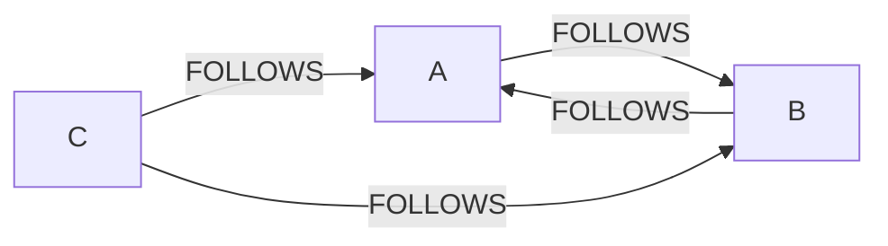
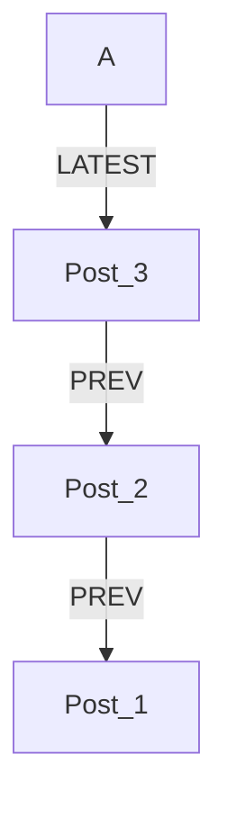

# The Concept of Graph

A **graph** is a collection of **nodes** (entities) and **relationships** (edges) connecting them. This schema-free structure can model virtually anything: Social networks, supply chains, road systems, etc.

For example, a social network where users follow each other:

**Relationships** carry **semantic** meaning - we can immediately see who follows whom and whether it's mutual.

Graphs can also mix entity types. For instance, adding posts to a user node as a linked list:

`LATEST` points to the most recent post & `PREV` chains form a timeline.

Different concerns (social connections + content) coexist naturally in the same graph.
