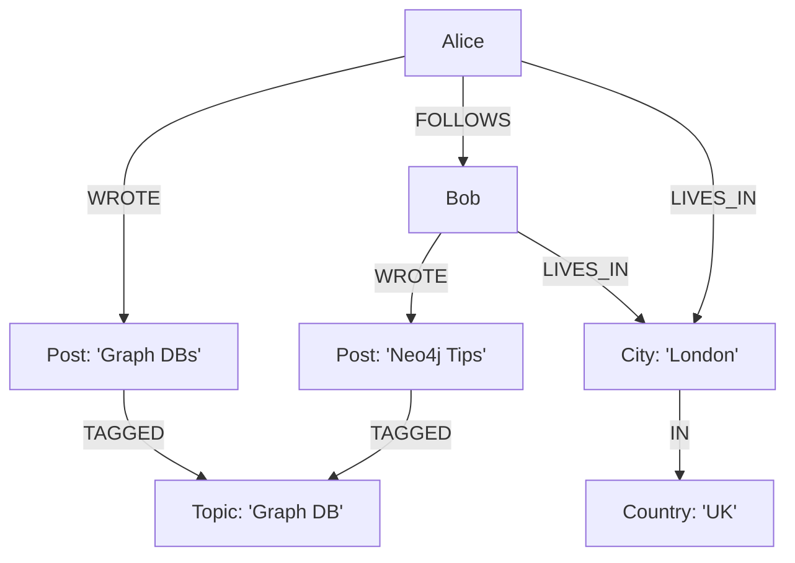
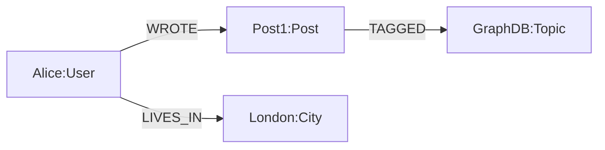
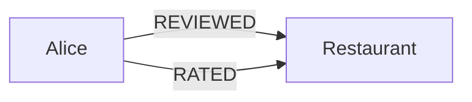
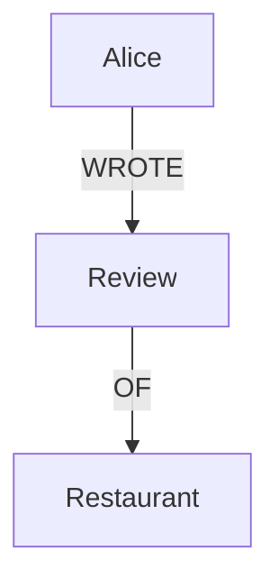
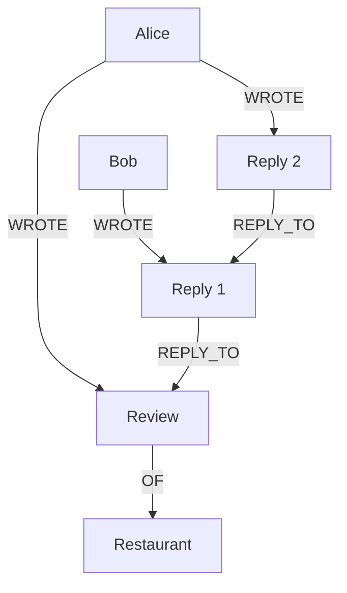

# Graph Data Modeling

This document covers:

- How to solve a real-world problem by using graph modeling techniques.
- Comparing relational and graph modeling techniques.
- Guidelines for structuring nodes and relationships & common pitfalls.
- How to evolve graph over time.

## Modeling

> This notes my own remarks, not according to the book.

Modeling is a common activity in science: The world is messy and we can't possibly predict every behavior of it. Modeling is a simplification process where we selectively expose certain useful aspects of the world to easily study it.

With a good model, we can predict surprisingly quite precisely the behavior of the world.

Note that a model is just an approximation of the world. So, a model can break down if it tries to extrapolate too far from its original assumptions. That doesn't make a model useless, however. The sole role of the model is to enable accurate-enough reasoning about the world within some known set of constraints.

## Graph Modeling as a Data Modeling Technique

Graph models are a tool for modeling the world. It allows useful queries about the world.

Compared to relational data modeling techniques, the graph data models' distinguishing point is the **close affinity between the logical and physical models**.

Relational techniques force us to deviate from our natural representation of the domain through multiple transformations, each introducing semantic dissonance:

### The Relational Path for Modeling

Here are the typical steps for relational modeling:

1. **Whiteboard sketch**:
   - Understand entities, how they interrelate, rules governing state transitions.
   - Done informally with domain experts.
   - The result is already a graph.
2. **E-R diagram**:
   - A more rigorous form of the whiteboard sketch.
   - However, E-R diagrams only allow single, undirected relationships.
   - A poor fit for domains where relationships are numerous and semantically diverse.
3. **Normalize into tables**:
   - Map E-R diagram into tables and relations.
   - Even the simplest case introduces accidental complexity.
   - Foreign key constraints (for 1:N) and join tables (for M:N) clutter the model with metadata that serves the database, not the user.
4. **Denormalize for performance**:
   - Normalized models are generally not fast enough for production.
   - Duplicate data and abandon domain fidelity to suit the database engine.
   - Requires RDBMS expertise and accepts substantial data redundancy.
5. **Migration**:
   - Introducing structural change is slow, risky, and expensive (weeks/months with downtime).
   - Unlike code refactoring (seconds/minutes), database refactoring is a heavyweight operation.
   - The denormalized model resists rapid evolution.

The result:

- A gulf between the conceptual world and the physical data layout.
- Business stakeholders can't collaborate past the relational threshold.
- Changed business requirements lag behind because translating them into entrenched relational structures is difficult.
- Failed migrations risk data integrity.

### The Graph Path for Modeling

1. **Whiteboard sketch**:
   - Same as relational. Understand entities and their interrelations with domain experts.
2. **Enrich the graph**:
   - Instead of transforming into tables, _enrich_ the whiteboard sketch.
   - Add properties to nodes and named, directed relationships.
   - The model is a purposeful abstraction attuned to the application's data needs.
3. **Store directly**:
   - No normalization, no denormalization, no join tables.
   - What you sketch is what you store.
   - Domain modeling is isomorphic to graph modeling.

## Testing the Model

Once the domain model is refined, test it before building the application. Bad design decisions baked in early are harder to fix later. Two techniques:

### 1. Read the Graph Aloud

Pick a start node, follow relationships, read each node's role and relationship name. It should form sensible sentences:

- "Alice wrote Post X, which has Comment Y, which Bob authored"
- "Post X is tagged with Topic Z, which Category W contains"

If it reads well, the model is faithful to the domain.

### 2. Design for Queryability

Write the queries you expect to run and verify the graph supports them. This requires understanding end users' goals.

Example: In a blog platform, find all posts by authors that a user follows:

```sql
START user=node:users(name = 'Alice')
MATCH (user)-[:FOLLOWS]->(author)-[:WROTE]->(post)
RETURN author.name, post.title
ORDER BY post.date DESC
```

If such a query is readily supported by the graph, the design is fit for purpose. If not, the model needs restructuring before any code is written.

## Cross-Domain Models

Interesting remarks:

- Relationships both **partition** a graph into separate domains and **connect** them.
- Shared nodes eliminate data duplication across domains.
- Traversal crosses domain boundaries seamlessly.
- Scaling is additive (more nodes and relationships, no schema changes).

Example: A blog platform with three domains (content, social, geospatial):



`London` and `GraphDB` are shared nodes: They participate in multiple domains without duplication. A single traversal can answer "find posts about Graph DB written by people who live near me."

## Node Labels

Relationships establish semantic context, but are a weak indicator of what a node _is_. In the graph above, following `WROTE` tells you the end node is a post, but nothing on the node itself says so. Labels fix this:



Labels attach one or more type tags to a node as first-class citizens: `(alice:User:Customer)`. Queries can filter by label (`MATCH (n:User)`), and labels can carry constraints (e.g. uniqueness).

## Common Modeling Pitfalls

Expressivity is no guarantee a graph is fit for purpose.

### Don't Encode Entities as Relationships

The most common mistake: Folding a noun into a verb. Everyday language encourages "Alice reviewed the restaurant" which loses the review entity.

Bad model:



This tells us Alice reviewed the restaurant, but we can't see:

- The review text or the rating value.
- When the review was written.
- Whether the REVIEWED and RATED refer to the same visit.

Even adding properties to REVIEWED doesn't help: You still can't correlate it with the RATED relationship.

The root cause: English shortens "Alice wrote a review of the restaurant" into "Alice reviewed the restaurant". The noun (review) disappears, folded into a relationship.

Good model:



Now the review is a first-class node with its own properties (text, rating, date). Multiple reviews by the same user or of the same restaurant are distinct nodes.

Once entities are modeled as nodes, powerful queries become possible. For example, "find all restaurants where Alice gave a higher rating than the average":

```sql
START alice=node:user(name='Alice')
MATCH (alice)-[:WROTE]->(review)-[:OF]->(restaurant)
WHERE review.rating > 3
RETURN restaurant.name, review.rating
```

This query only works because the review is a node with its own properties (rating, text, date). With the bad model (REVIEWED as a relationship), filtering by rating or correlating review details would be impossible.

### Don't Conflate Entities and Relationships

Use relationships to convey _how_ things are related. Domain entities aren't always obvious from everyday language: Think carefully about the nouns. If you find yourself wanting to attach properties to a relationship or connect a relationship to more than two nodes, it should probably be a node.

### Don't Optimize Writes at the Cost of Model Fidelity

Trust the graph database to handle performance. Model according to the questions you want to ask. Graph databases maintain fast query times even when storing vast amounts of fine-grained data.

## Domain Evolution

Migrations in graph databases are simpler than in relational databases:

- **Adding new relationship types** (e.g. REPLY_TO, FORWARD_OF): Completely safe. Existing queries don't know about them, so nothing breaks.
- **Adding new nodes**: Safe. Extends the graph without affecting existing structure.
- **Changing existing relationship types or node properties**: Might affect existing queries. Run a representative set of queries to verify.

These are the same operations performed during normal database usage, so migration in a graph world is just business as normal.

### The Same Pitfall Applies to Evolution

When adding new features, the "entities as relationships" pitfall recurs. For example, adding reply/forward support:

For example, adding a "reply" feature to a review platform:

Bad:

```
(bob)-[:REPLIED_TO]->(review)
```

Lossy: Can't see what Bob actually said, or distinguish between multiple replies.

Good: A reply is itself a new node:



This enables queries like "find the full reply chain for a review":

```sql
START review = node:review(id = '1')
MATCH p=(review)<-[:REPLY_TO*1..4]-()<-[:WROTE]-(replier)
RETURN replier.name AS replier, length(p) - 1 AS depth
ORDER BY depth
```
