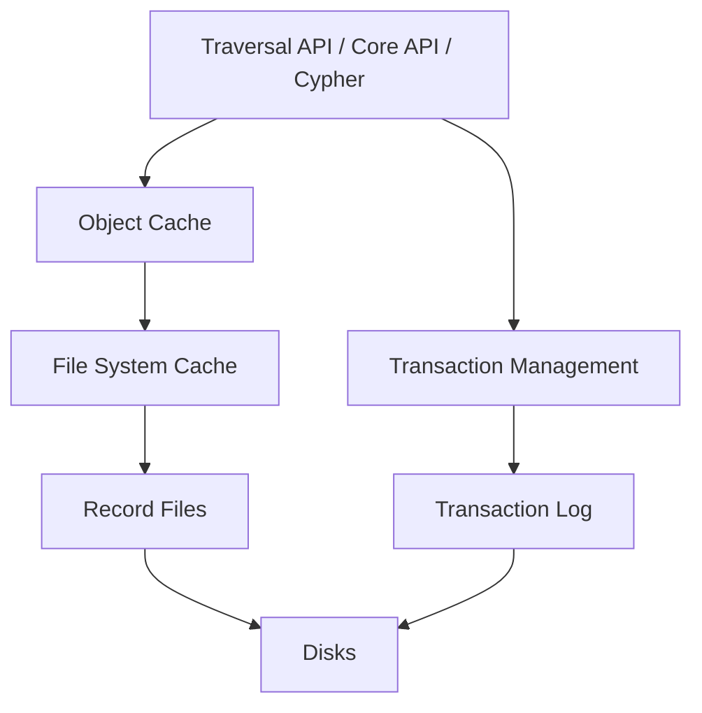

# Neo4j Internals: Native Graph Storage

Part of the Neo4j internals series: [Native Graph Processing](./11-native-graph-processing.md) | **Native Graph Storage** | [Transactions, Availability, Scale](./13-internals-transactions-availability-scale.md)

- Neo4j stores graph data in a number of different **store files**.
- Each store file contains the data for a specific part of the graph (nodes, relationships, properties).
- This division of storage responsibilities separates graph structure from property data, similar to columnar storage or ECS (Entity Component System) in game engines: Group data by concern, not by entity, so the hot path (traversal) doesn't waste I/O loading data it's just passing through.

## Architecture

## Store Files

Neo4j maintains multiple stores:

- Traversal only needs to know _which nodes are connected_, not _what data they hold_.
- By splitting structure (nodes, relationships) from content (properties), traversal touches only the small, fixed-size structure records and skips property data entirely until explicitly requested.

All stores use **fixed-size records** so any record's location can be computed by `ID * record_size`. This makes lookups O(1).

- **Node store**: Where each node lives, and entry points to its relationships and properties.
- **Relationship store**: How nodes are connected, and the linked list pointers for traversal.
- **Property store**: The actual data (key-value pairs) attached to nodes and relationships. Only loaded when needed.

### Node Store (`neostore.nodestore.db`)

Each node record acts as an "address book": It tells you where to find the node's relationships and properties. It stores no actual user data, just pointers.

- Fixed-size records (9 bytes).
- Each record contains the following.
  - **In-use flag** (1 byte): Whether this record is active or reclaimable.
  - **Pointer to first relationship** (4 bytes): Entry point into the relationship chain (a linked list of all relationships connected to this node).
  - **Pointer to first property** (4 bytes): Entry point into the property chain (a linked list of key-value pairs for this node).
- A node record stores no actual data. It's just pointers to where the data lives (relationships and properties are in their own store files).

### Relationship Store (`neostore.relationshipstore.db`)

This store holds the wiring between nodes. Each record knows which two nodes it connects and how to find the next relationship for both of them. It stores no user data, just structure.

- Fixed-size records (33 bytes).
- Each record contains the following.
  - **Start node ID** (4 bytes): The node at the start of this relationship.
  - **End node ID** (4 bytes): The node at the end of this relationship.
  - **Relationship type pointer** (4 bytes): Points to the relationship type store.
  - **Next/prev relationship pointers for start node** (4+4 bytes): Doubly linked list of all relationships visible from the start node.
  - **Next/prev relationship pointers for end node** (4+4 bytes): Same for end node.
  - **Next property pointer** (4 bytes): Entry point into this relationship's property chain.
- A relationship record "belongs" to both its start and end nodes. The doubly linked list pointers form the **relationship chain**: Iterating a node's relationships means following this chain. Doubly linked allows traversal in either direction and efficient insert/delete.

### Property Store (`neostore.propertystore.db`)

This is where the actual user data lives as key-value pairs. It is only touched when a query explicitly requests property values, not during traversal.

- Fixed-size records with four property blocks each.
- **Singly linked list** (pointer to next property record).
- Property names are deduplicated via a separate property index file.
- **Small values** (numbers, short strings) can be **inlined** directly in the property block, avoiding extra I/O.
- **Large values** (long strings, arrays) go to separate dynamic stores.

### How a Traversal Works

1. Start at a node record. Follow its pointer to the first relationship in the chain.
2. Compute the relationship's byte offset: `relationship_ID * 33`. O(1) lookup.
3. From the relationship record, read the other node's ID.
4. Compute that node's byte offset: `node_ID * 9`. O(1) lookup.
5. Repeat.

No index involved at any step. Just pointer arithmetic on fixed-size records.
