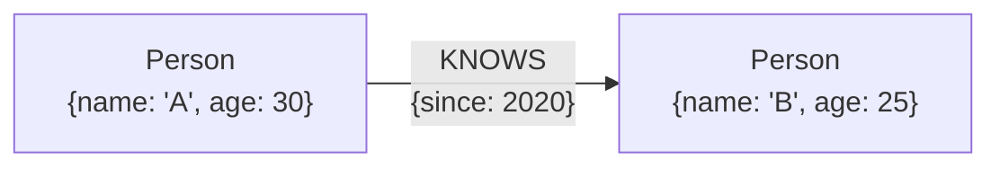

# The Property Graph Model

The most popular graph model variant. A property graph is made up of **nodes**, **relationships**, and **properties**.

- **Nodes** contain properties: Arbitrary key-value pairs where keys are strings and values are arbitrary data types. Think of nodes as documents.
- **Relationships** connect and structure nodes. A relationship always has a **direction**, a **label**, a **start node**, and an **end node**: There are no dangling relationships. Direction and label together add semantic clarity.
- Both nodes and relationships can hold **properties**. Relationship properties are particularly useful for the following.
  - Providing metadata for graph algorithms.
  - Adding semantics (quality, weight).
  - Constraining queries at runtime.

Simple enough to be intuitive, yet expressive enough for the vast majority of graph use cases. These primitives are all that's needed to create sophisticated, semantically rich models.
