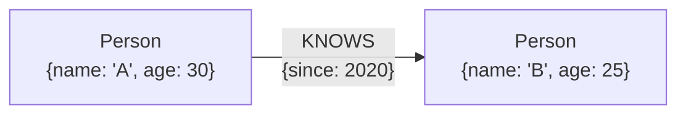

# The Property Graph Model

The most popular graph model variant, with four key traits:

- **Nodes** and **relationships** form the structure.
- Both nodes and relationships can hold **properties** (key-value pairs).
- Relationships are **named** and **directed** - they always have a start node and an end node.

Simple enough to be intuitive, yet expressive enough for the vast majority of graph use cases.
