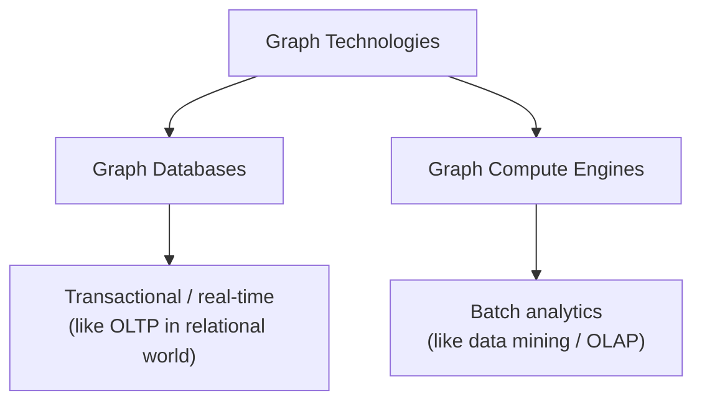

# The Graph Space

The graph space can be split along two axes: **by usage** and **by data model**.

## By Usage

- **Graph databases**: The graph equivalent of a regular OLTP database.
  - Always running.
  - Always serving low-latency reads/writes with full ACID guarantees.
  - Used as the primary data store by an application.

  This is the main focus of this book.

- **Graph compute engines** - for offline batch analytics over graph data (similar to data mining/OLAP).

## By Data Model

Three dominant graph data models exist:

- **Property graph** - the most popular, used by most graph databases. Covered throughout this book.
- **RDF triples** - Resource Description Framework, common in [semantic web](../../web-3.md).
- **Hypergraphs** - a single edge can connect more than two nodes at once.

### Property Graph vs RDF

Both represent data as nodes + named edges and can model the same data. The differences are in conventions and ecosystem:

|                | Property Graph                              | RDF                                                              |
| -------------- | ------------------------------------------- | ---------------------------------------------------------------- |
| Properties     | Key-value pairs directly on nodes and edges | Extra triples (e.g. `Alice --hasAge--> 30`)                      |
| Relationships  | First-class, can hold properties            | Triples - adding metadata to a relationship requires extra nodes |
| Schema         | Ad-hoc, no predefined schema                | Formal ontologies (OWL/RDFS)                                     |
| Optimized for  | Fast traversal, app queries                 | Semantic reasoning, cross-org interoperability                   |
| Query language | Cypher, Gremlin                             | SPARQL                                                           |

Property graphs trade semantic rigor for **compactness and speed**. RDF trades compactness for **global interoperability and machine reasoning**.

RDF's formal ontologies (OWL/RDFS) enable **automatic inference** - the system derives new facts from existing data without custom code. For example, given `Dog subclassOf Animal` and `Rex type Dog`, an RDF store infers `Rex type Animal`. You could build similar reasoning on a property graph, but it would be custom logic rather than a standardized format other systems understand.
