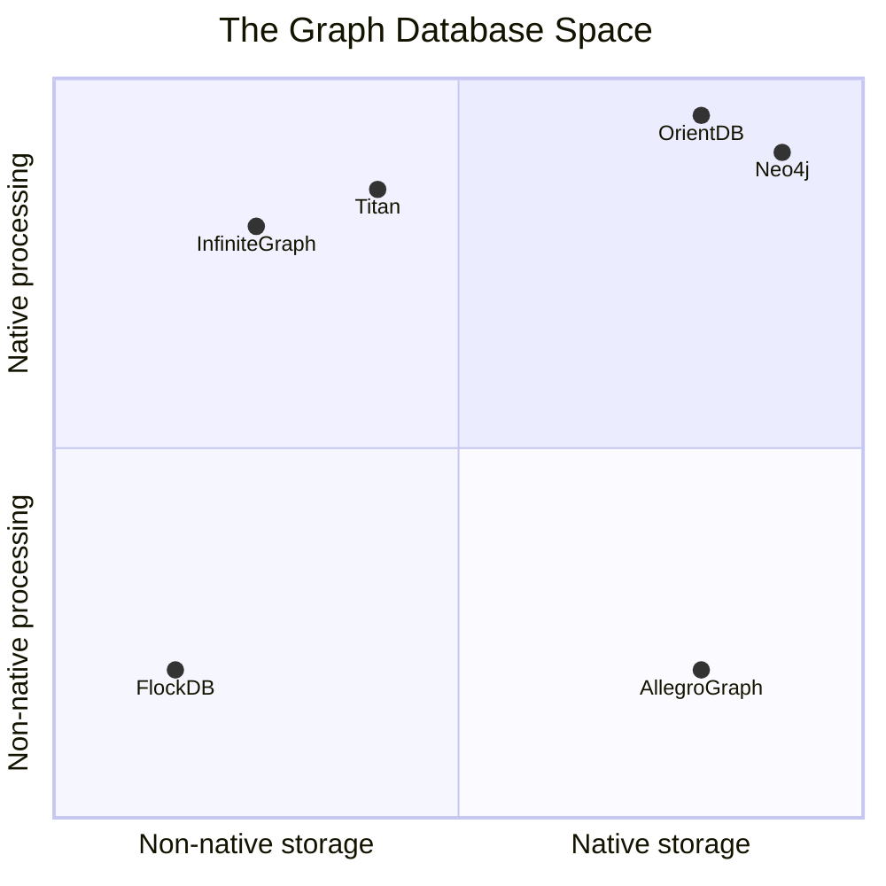

# Graph Database

- An **online** database with **CRUD operations** that exposes a **graph data model**.
- Optimized for transactional (OLTP) workloads - transactional integrity and operational availability.

Relationships are **first-class citizens**, unlike relational databases (foreign keys) or other NoSQL stores (map-reduce).

This allows building models that map closely to the problem domain.

## Two Dimensions

Graph databases vary along two axes: The underlying storage (**native graph storage** & **non-native graph storage**) & The procesisng engine (**native graph processing** & **non-native graph processing**).

Legend:

- **Storage** = how data is persisted on disk.
- **Processing** = how the engine traverses/queries data at runtime.

|                        | Native Processing    | Non-native Processing |
| ---------------------- | -------------------- | --------------------- |
| **Native Storage**     | Neo4j, OrientDB      | AllegroGraph          |
| **Non-native Storage** | Titan, InfiniteGraph | FlockDB               |

These are engineering trade-offs, not inherently good or bad. Native/native is fastest for graph workloads. Non-native/non-native is easiest to operate.

### Native Graph Storage

Custom storage format designed for graphs - nodes, relationships, and properties stored in dedicated structures. E.g. Neo4j uses fixed-size record files for nodes and relationships.

- **Pro**: Engineered for graph performance and scalability.
- **Con**: Less battle-tested than mature backends.

### Non-native Graph Storage

Graph data serialized into an existing backend (e.g. MySQL, Cassandra). The graph is an abstraction layer on top.

- **Pro**: Ops teams already know the backend.
- **Con**: Overhead from translating between graph and non-graph representations.

### Native Graph Processing (Index-Free Adjacency)

Each node physically stores a pointer to its neighbors. Traversing an edge = following a pointer.

- **Pro**: O(1) per hop, regardless of total graph size.
- **Con**: Non-traversal queries can be difficult or memory-intensive.

### Non-native Graph Processing

To find a node's neighbors, the engine does an index lookup (e.g. B-tree scan).

- **Pro**: Index-based lookups are well understood and flexible.
- **Con**: O(log n) per hop, degrades as the graph grows.
