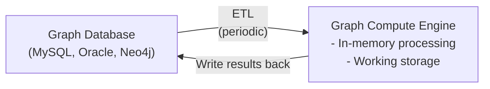

# Graph Compute Engine

A **batch processing framework specialized for graph data**, think Hadoop/Spark, but for graphs. It's the graph equivalent of data mining/OLAP in the relational world.

It is **not a database**. It doesn't store data persistently, handle real-time queries, or support CRUD operations. It's a compute layer that takes graph data in (fed from a database via ETL), runs [global graph algorithms](./5-concept-local-vs-global-graph-operations.md) across the entire dataset, and spits results out. The "engine" part means it handles the parallelization for you.

If a graph database is the waiter taking orders in real time, the graph compute engine is the kitchen doing meal prep overnight.

## Graph Compute Engine vs Graph Database

They often work together: The graph database handles real-time app queries, the graph compute engine periodically crunches the whole graph offline and writes computed results back into the graph database for the app to use. Think of it like PostgreSQL (graph database) vs Spark (graph compute engine): One is your live database, the other is your batch analytics layer. Same relationship, just graph-flavored.

Example: You have a social network stored in Neo4j (your graph database, serving your app). Once a day, you ETL that data into Giraph (your graph compute engine), run PageRank to find influential users, and write the results back. Your app then reads those precomputed scores from Neo4j.

## Processing Models

- **In-memory/single machine**: E.g. Cassovary.
- **Distributed**: E.g. Pegasus, Giraph, most are based on Google's **Pregel** paper (the engine Google uses to rank pages).
