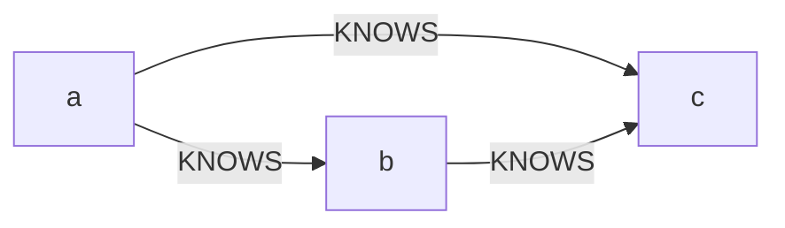

# Neo4j Cypher Query Language

**Cypher** is a query language that is:

- Expressive yet compact, with syntax close to how we draw graphs on whiteboards.
- **Declarative** & **pattern-matching** (like tree query in tree-sitter).
- Specific to Neo4j.

Cypher describes graphs using ASCII art: `(a)-[:KNOWS]->(b)` reads as "a KNOWS b".

There are some alternatives to **Cypher**:

- Many (including Neo4j) support **SPARQL** (RDF query language).
  > Remark: So there's an adapter or something?
- **Gremlin** (imperative, path-based).

## Philosophy

The main priority is for human-readability, including technical and non-technical users.

- Cypher lets users describe **what** to find, not **how** to find it.
- A Cypher query anchors part of the pattern to starting locations in the graph (typically found via an index), then flexes the unanchored parts to find local matches.

  > In other words, Cypher first locate the starting node and navigate from there.

## Syntax Basics

Cypher uses ASCII art to represent graph patterns. Parentheses for nodes, square brackets for relationships, curly braces for properties:

| Pattern                       | Syntax                  | Example                                                                                                                                                              |
| ----------------------------- | ----------------------- | -------------------------------------------------------------------------------------------------------------------------------------------------------------------- |
| Any node (anonymous)          | `()`                    | `(a)<-[:VENUE]-()` matches any node connected to `a` via VENUE, without binding it to a variable. Use when you don't need the node's details elsewhere in the query. |
| Node (bound to variable)      | `(identifier)`          | `(a)`                                                                                                                                                                |
| Node with properties          | `({key: value})`        | `(a {name: 'Alice'})`                                                                                                                                                |
| Node with label               | `(:Label)`              | `(a:Person)`                                                                                                                                                         |
| Relationship (directed)       | `-[:TYPE]->`            | `(a)-[:KNOWS]->(b)`                                                                                                                                                  |
| Relationship (undirected)     | `-[:TYPE]-`             | `(a)-[:KNOWS]-(b)`                                                                                                                                                   |
| Relationship with properties  | `-[:TYPE {key: val}]->` | `(a)-[:KNOWS {since: 2020}]->(b)`                                                                                                                                    |
| Relationship type OR          | `-[:TYPE1\|TYPE2]->`    | `(a)-[:STREET\|CITY]->(b)` matches either STREET or CITY                                                                                                             |
| Variable-length path          | `-[:TYPE*min..max]->`   | `(a)-[:KNOWS*1..3]->(b)` matches paths 1 to 3 hops long                                                                                                              |
| Combined OR + variable-length | `-[:T1\|T2*1..N]->`     | `(a)-[:STREET\|CITY*1..2]->(b)` either type, 1 to 2 hops                                                                                                             |
| Bind relationship to variable | `-[r:TYPE]->`           | `(a)-[w:WROTE]->(b)` then access `w.year`                                                                                                                            |
| Property access               | `node.property`         | `a.name`                                                                                                                                                             |

## Syntax & Examples



The equivalent ASCII art in Cypher:

```sql
(a)-[:KNOWS]->(b)-[:KNOWS]->(c), (a)-[:KNOWS]->(c)
```

> Remark: Not quite sure, the book's graph direction is reversed, I've fixed that to match the ASCII graph. But I don't know if I'm correct.

Since a query is one-dimensional text but graphs are two-dimensional, the pattern is split into comma-separated subpatterns.

A full query anchors the pattern to a starting node via index lookup:

```sql
START a=node:user(name='Michael')
MATCH (a)-[:KNOWS]->(b)-[:KNOWS]->(c), (a)-[:KNOWS]->(c)
RETURN b, c
```

The simplest Cypher queries consist of **START** (find anchor points), **MATCH** (draw the pattern), and **RETURN** (specify output).

## Clauses Overview

| Clause                     | Purpose                                  | Category |
| -------------------------- | ---------------------------------------- | -------- |
| `START`                    | Find starting nodes via index lookup     | Read     |
| `MATCH`                    | Draw a pattern to find in the graph      | Read     |
| `RETURN`                   | Specify what to return to the client     | Read     |
| `WHERE`                    | Filter pattern matching results          | Read     |
| `WITH`                     | Chain query parts (pipe results)         | Read     |
| `CREATE` / `CREATE UNIQUE` | Create nodes and relationships           | Write    |
| `SET`                      | Set property values                      | Write    |
| `DELETE`                   | Remove nodes, relationships, properties  | Write    |
| `FOREACH`                  | Run an update for each element in a list | Write    |
| `UNION`                    | Merge results from multiple queries      | Read     |

Assume the following graph exists for all examples:

```sql
CREATE (alice {name:'Alice', age:30}),
       (bob {name:'Bob', age:25}),
       (charlie {name:'Charlie', age:35}),
       (alice)-[:KNOWS {since:2018}]->(bob),
       (bob)-[:KNOWS {since:2020}]->(charlie),
       (alice)-[:KNOWS {since:2019}]->(charlie)
```

- This `CREATE` does two things in one statement: Creates nodes (with properties), and relates them (with relationship properties).
- It runs in a single transaction: Either the full graph is created, or none of it is (ACID).
- Identifiers like `alice`, `bob`, `charlie` are temporary, scoped to this query only.
- Within the query, they can be reused to attach relationships. Once the query ends, they're gone.
- To give nodes long-lived names, add them to an **index**.

### `START` Clause

Cypher queries always begin from one or more well-known starting points in the graph, called **bound nodes**.

`START` provides these by:

- Looking them up from an index.
- Direct ID.

These bound nodes become the anchor points from which the rest of the graph is explored.

The index lookup syntax is `node:indexName(key='value')`:

- `node` - Look up a node (vs a relationship).
- `indexName` - The name of the index to search (e.g. `user`, `venue`, `city`). Different node types go in different indexes.
- `(key='value')` - The property to match.

> Note: This is legacy index syntax from Neo4j 1.x/2.x. Modern Neo4j uses schema indexes with `MATCH (n:Label {prop: value})` instead.

```sql
START a=node:user(name='Alice'),
      b=node:user(name='Bob')
MATCH (a)-[r:KNOWS]->(b)
RETURN r.since
```

Output: `2018`

This query starts from Alice and Bob, matches the relationship `KNOWS` between them, then extracts the `since` property from the relationship.

`START` scopes the query to a local region of the graph. Without it, a pattern could match anywhere. You can bind from different indexes in one `START`:

```sql
START theater=node:venue(name='Theatre Royal'),
      city=node:city(name='Newcastle'),
      author=node:author(lastname='Shakespeare')
```

### `MATCH` Clause

Draws an ASCII art pattern to find in the graph. `()` are nodes, `-[:TYPE]->` are relationships. An empty `()` means "any node, I don't care about binding it to a variable".

Bound identifiers from `START` anchor the pattern. Unbound identifiers (`friend` below) flex to match all possibilities.

```sql
START a=node:user(name='Alice')
MATCH (a)-[:KNOWS]->(friend)-[:KNOWS]->(fof)
WHERE fof <> a
RETURN friend.name AS friend, fof.name AS friend_of_friend
```

Output:

| friend | friend_of_friend |
| ------ | ---------------- |
| "Bob"  | "Charlie"        |

`a` is anchored to Alice. `MATCH` finds all nodes one hop away (`friend`), then another hop (`fof`). The pattern can match multiple times, producing one row per match.

### `RETURN` Clause

Processes matched data before returning it. Supports:

- **Aliasing**: `RETURN friend.name AS name`.
- **DISTINCT**: Deduplicates when a node matches via multiple paths.
- **Aggregation**: `count()`, `collect()`, `sum()`, `avg()`, etc.
- **Ordering**: `ORDER BY ... ASC/DESC`.
- **Limiting**: `LIMIT N`, `SKIP N`.

Simple return with aliasing and ordering:

```sql
START a=node:user(name='Alice')
MATCH (a)-[:KNOWS]->(friend)
RETURN friend.name AS name, friend.age AS age
ORDER BY age DESC
```

Output:

| name      | age |
| --------- | --- |
| "Charlie" | 35  |
| "Bob"     | 25  |

Aggregation: Bind a relationship to a variable in `MATCH`, then count it in `RETURN`:

```sql
START a=node:user(name='Alice')
MATCH (a)-[r:KNOWS]->()
RETURN count(r) AS friends_count
```

Output: `2`

### `WHERE` Clause

Filters matched subgraphs. Where `MATCH` describes structure, `WHERE` tunes the results by checking:

- Certain paths must be present (or absent).
- Specific properties must exist (or not), regardless of value.
- Properties must have specific values.
- Arbitrary expression predicates.

```sql
START a=node:user(name='Alice')
MATCH (a)-[:KNOWS]->(friend)
WHERE friend.age > 28
RETURN friend.name
```

Output:

| friend.name |
| ----------- |
| "Charlie"   |

### `CREATE` / `CREATE UNIQUE` Clause

Creates nodes and relationships.

- `CREATE`: Always adds to the graph. Use when duplication is acceptable.
- `CREATE UNIQUE`: Ensures a subgraph structure exists. Only creates missing parts. Use when duplication is not permitted by the domain.

```sql
START alice=node:user(name='Alice')
CREATE (dave {name:'Dave', age:28})-[:KNOWS]->(alice)
```

Output: 1 node created, 1 relationship created.

```sql
START alice=node:user(name='Alice')
CREATE UNIQUE (alice)-[:KNOWS]->(bob {name:'Bob'})
```

Output: If Alice already KNOWS a Bob, nothing is created. Otherwise, 1 node and 1 relationship created.

### `SET` Clause

Sets property values on existing nodes/relationships.

```sql
START a=node:user(name='Alice')
SET a.age = 31
RETURN a.age
```

Output: `31`

### `DELETE` Clause

Removes nodes, relationships, and properties. Must delete relationships before their nodes.

```sql
START a=node:user(name='Bob')
MATCH (a)-[r]-()
DELETE r, a
```

Output: 1 node deleted, 2 relationships deleted.

### `WITH`

Sometimes a single `MATCH` isn't enough. `WITH` chains query parts, piping results from one to the next (like Unix pipes). It also enforces discipline by separating read-only clauses from write-centric `SET` operations.

```sql
START a=node:user(name='Alice')
MATCH (a)-[k:KNOWS]->(friend)
WITH friend
ORDER BY friend.age DESC
RETURN collect(friend.name) AS friends
```

The first part matches and orders friends by age. `WITH` pipes the ordered results into `collect()`, which produces a list.

Output:

| friends            |
| ------------------ |
| ["Charlie", "Bob"] |

### `FOREACH`

Runs an update for each element in a list.

```sql
FOREACH (name IN ['Dave','Eve'] |
  CREATE ({name: name}))
```

Output: 2 nodes created.

### `UNION`

Merges results from two or more queries. Column names must match.

```sql
START a=node:user(name='Alice')
MATCH (a)-[:KNOWS]->(f)
RETURN f.name AS name
UNION
START a=node:user(name='Bob')
MATCH (a)-[:KNOWS]->(f)
RETURN f.name AS name
```

Output:

| name      |
| --------- |
| "Bob"     |
| "Charlie" |

(`UNION` deduplicates. Use `UNION ALL` to keep duplicates.)

These clauses are intentionally familiar to SQL developers, but different enough to emphasize that we're dealing with graphs, not relational sets.
