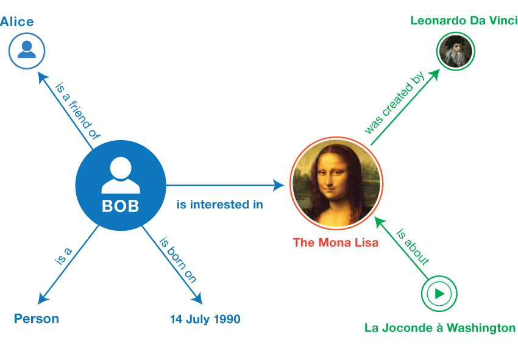
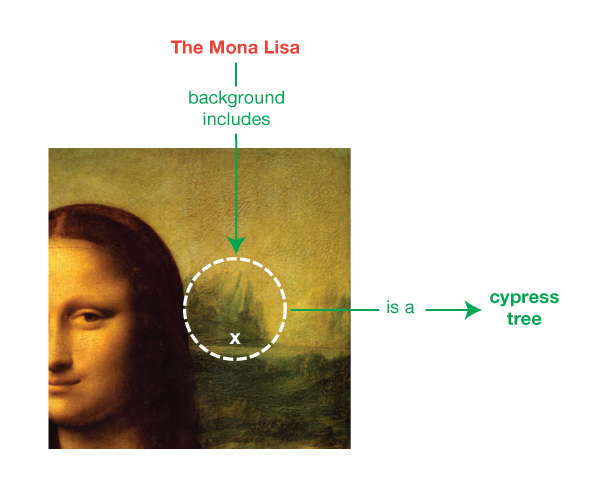
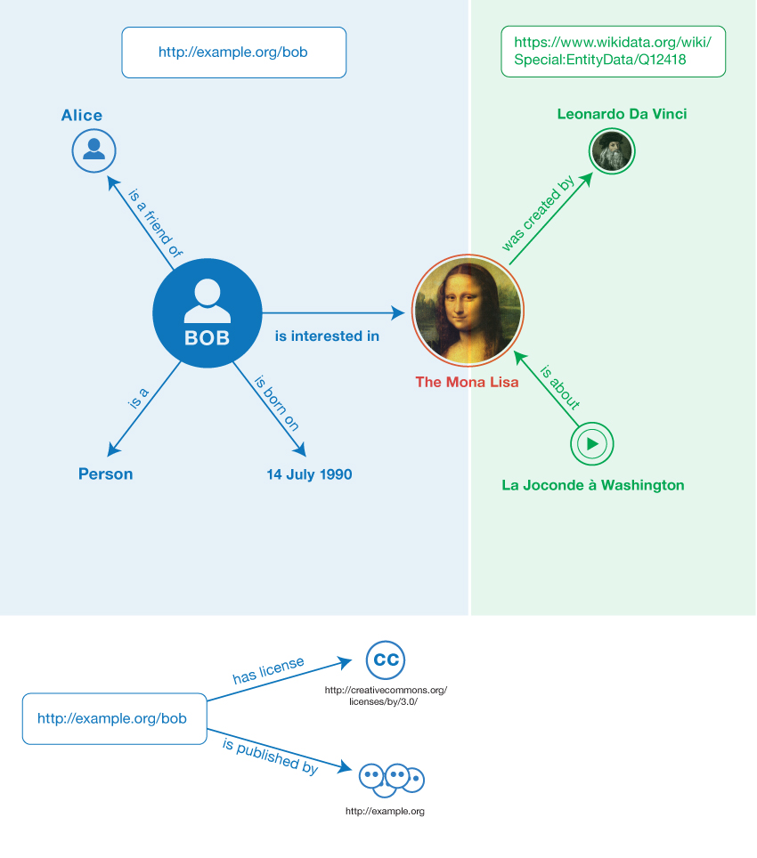

# RDF Data Model

Based on:

- [W3C RDF 1.2 Primer](https://www.w3.org/TR/rdf12-primer/): An informative Group Note Drafts and no guarantee is made regarding its claims.
- [W3C RDF 1.2 Concepts](https://www.w3.org/TR/rdf12-concepts/): A normative specs, as oppose to the above specs.

This documents the **abstract data model** of RDF - the logical structure of triples, IRIs, literals, etc. This is independent of any concrete syntax. For example, the abstract model only specifies that a literal carries a datatype IRI: each serialization format has its own way of specifying datatypes, which identifiers have innate datatype meaning, and how to parse them.

For concrete syntaxes (Turtle, JSON-LD, etc.), see [Serialization Formats](./serialization.md).

An alternative graph model is the [property graph model](../../../graph-database/graph-databases-book/2-concept-property-graph-model.md). For a light-hearted comparison between RDF and property graph, see [link](../../../graph-database/graph-databases-book/3-the-graph-space.md).

> RDF allows **statements** to be made about **resources**.

## Triples

In RDF, a **statement** is written in **triples.**

The fundamental RDF structure is a **[triple](https://www.w3.org/TR/rdf12-concepts/#dfn-rdf-triple)**:

- **[Subject](https://www.w3.org/TR/rdf12-concepts/#dfn-subject)**: The 1st of the two resources being related.
- **[Predicate](https://www.w3.org/TR/rdf12-concepts/#dfn-predicate)**: The nature of the relationship.
- **[Object](https://www.w3.org/TR/rdf12-concepts/#dfn-object)**: The 2nd of the two resources being related.

Each triple expresses a directional relationship between two resources. This relationship is also called a **property**.

Example from `w3.org`:

```
<Bob> <is a> <person>.
<Bob> <is a friend of> <Alice>.
<Bob> <is born on> <the 4th of July 1990>.
<Bob> <is interested in> <the Mona Lisa>.
<the Mona Lisa> <was created by> <Leonardo da Vinci>.
<the video 'La Joconde à Washington'> <is about> <the Mona Lisa>.
```


_Image from [W3C RDF 1.2 Primer](https://www.w3.org/TR/rdf12-primer/)._

A resource can be referenced in more than one resources.

A collection of triples forms an **[RDF graph](https://www.w3.org/TR/rdf12-concepts/#dfn-rdf-graph)**, where subjects and objects are nodes and predicates are directed edges.

## IRIs

[**IRI**](https://www.w3.org/TR/rdf12-concepts/#dfn-iri) stands for Internationalized Resource Identifier, a generalization of URI that supports Unicode. **IRIs can appear in all three positions of a triple**.

As stated by [RFC 3986](../uri/rfc-3986.md#global-interpretation-not-identityaccess), IRIs have **global interpretation**. Whether an IRI also serves as a globally unique identifier depends on the IRI you choose, not the spec.

In practice, the semantic web relies on IRIs that _are_ globally unique - for example, `http://xmlns.com/foaf/0.1/knows` is used by many people as an RDF property for acquaintance relationships.

> The W3C RDF Primer calls IRIs "global identifiers". This is confusing, at least to me, the [URI RFC](../uri/rfc-3986.md#global-interpretation-not-identityaccess) explicitly states that URIs (and by extension IRIs) provide global **interpretation**, not global **identity** or **access**. `http://localhost/` is parsed the same way everywhere, but it resolves to a different machine for each user. Global uniqueness is a property of well-chosen IRIs (e.g. `http://dbpedia.org/resource/London`), not a guarantee of the spec itself.

### RDF Interpretation of IRIs

**RDF itself is agnostic about what an IRI represents**: An **RDF processor** treats IRIs as **opaque strings**, it stores and queries triples without "understanding" what the IRIs refer to.

> So basically, RDFs are just triples of unique URIs.

Meaning of IRIs is given by **[vocabularies](https://www.w3.org/TR/rdf12-concepts/#dfn-rdf-vocabulary)**: sets of IRIs with documented meanings, published by some party.

### Vocabulary

A vocabulary can be defined at **different levels of formality**.

At every level, the core idea is the same: someone picks IRIs, publishes what they mean, and others reuse them.

The more formal the definition, the more machines can do with it: but even an informal vocabulary works as long as humans agree on the meaning (basically like XML in this case, but with agreed format for relationship specification).

For the full breakdown, see [RDF Vocabulary](./vocabulary.md).

#### Informal Vocabulary Definition

Approach: A web page listing terms and their human-readable descriptions.

For example, [Dublin Core](https://www.dublincore.org/specifications/dublin-core/dcmi-terms/) publishes a page describing terms like `dcterms:title` and `dcterms:creator`.

This is only for humans: an RDF processor cannot read or reason about informal definitions.

How it would be used:

1. The developer reads the vocabulary page to understand what each IRI means.
2. The developer writes RDF data using those IRIs.
3. The processor stores and queries the triples.

Correctness depends entirely on the developer using the IRIs consistently with their documented meaning.

#### Semi-formal Vocabulary Definition ([RDFS](./rdfs.md))

Approach: The vocabulary is defined _as RDF triples themselves_.

For example, [FOAF](http://xmlns.com/foaf/spec/) publishes an RDF file containing triples like:

```
<foaf:knows> <rdf:type> <rdf:Property> .
<foaf:knows> <rdfs:domain> <foaf:Person> .
```

This works because the RDF spec defines a small set of special IRIs (`rdf:type`, `rdfs:domain`, `rdfs:range`, etc.) whose meaning is **hardcoded into RDFS-aware processors**.

Vocabulary authors use these special IRIs to describe their own IRIs, and the processor applies its built-in inference rules to them.

> Remark: The meaning of the core IRIs (`rdfs:domain`, etc.) lives in the processor's code, not in more RDF. The vocabulary triples just provide input for those built-in rules. This is like built-ins in a high-level functional programming language: you compose `rdfs:domain`, `rdfs:subClassOf`, etc to express complex vocabulary definitions without touching the underlying implementation, just like using `map` or `filter` without caring how they work internally.

How it would be used:

1. The developer writes RDF data using the vocabulary's IRIs (same as informal).
2. The developer also feeds the vocabulary's RDF file into the processor.
3. The processor reasons over the vocabulary triples alongside the data triples - e.g. inferring that `<Bob>` is a `foaf:Person` because he appears as the subject of `foaf:knows`.

The processor enforces some of the vocabulary's meaning automatically, rather than relying purely on the developer.

#### Formal Vocabulary Definition ([OWL](../owl.md))

Approach: Same as RDFS, the vocabulary is defined as RDF triples, but with richer constraints: cardinality, disjointness, equivalence, etc.

An **OWL-aware processor** has **more built-in inference rules** than an **RDFS-aware one**.

How it would be used:

1. The developer writes RDF data using the vocabulary's IRIs (same as informal).
2. The developer also feeds the vocabulary's OWL file into the processor (same as semi-formal).
3. The processor reasons over the vocabulary triples with a richer set of inference rules - e.g. inferring that two classes are disjoint, or that a property can have at most one value.

The processor enforces more of the vocabulary's meaning automatically than RDFS can.

## Literals

**[Literals](https://www.w3.org/TR/rdf12-concepts/#dfn-literal)** encode values rather than identifying resources via IRIs. Literals can only appear in the **object** position of a triple.

In the abstract model, a literal is a tuple of:

- **[Lexical form](https://www.w3.org/TR/rdf12-concepts/#dfn-lexical-form)**: The value as a string (e.g. `"La Joconde"`, `"1990-07-04"`, `"3.14159"`).
- **[Datatype IRI](https://www.w3.org/TR/rdf12-concepts/#dfn-datatype-iri)**: Determines how to interpret the lexical form (e.g as a date, a number, or plain text).
- **[Language tag](https://www.w3.org/TR/rdf12-concepts/#dfn-language-tag)** (optional): Indicates the language of a string (e.g. English, French, Chinese). Literals with a language tag are called **language-tagged strings**.
- **[Base direction](https://www.w3.org/TR/rdf12-concepts/#dfn-base-direction)** (optional): Either left-to-right or right-to-left. Literals with both a language tag and base direction are called **[directional language-tagged strings](https://www.w3.org/TR/rdf12-concepts/#dfn-dir-lang-string)**. Base direction assists bidirectional text processing, without it, mixed-direction text can render incorrectly.

The [RDF Concepts](https://www.w3.org/TR/rdf12-concepts/) spec lists recognized datatypes, including many from XML Schema:

- `xsd:string`
- `xsd:boolean`
- `xsd:integer`
- `xsd:decimal`
- `xsd:date`

How literals are written down (e.g. `"1990-07-04"^^xsd:date` in Turtle) is a [serialization](./serialization.md) concern, not part of the abstract model.

## Blank Nodes

Sometimes it is useful to discuss resources without giving them a global identifier.

Such unnamed resources use **[blank nodes](https://www.w3.org/TR/rdf12-concepts/#dfn-blank-node)**. They function like simple variables: they stand for _something_ without specifying exactly what.

Blank nodes can appear in the **subject** and **object** positions only.


_Image from [W3C RDF 1.2 Primer](https://www.w3.org/TR/rdf12-primer/)._

## Triple Terms

A triple states a simple relationship between two resources. But sometimes we want to say **something _about_ that relationship itself**. For example, _when_ it started or _why_ it holds.

Consider: "Bob is interested in the Mona Lisa". This is a straightforward triple. But what if we also want to say that this interest started on the 4th of October 1998, and that it is classified as an Interest?

We could model the interest as a separate resource with its own properties. But then we lose the direct statement "Bob is interested in the Mona Lisa" - it gets buried inside a more complex structure. Ideally, we want both: the simple statement _and_ the ability to annotate it.

A **[reifier](https://www.w3.org/TR/rdf12-concepts/#dfn-reifier)** is a resource that represents a concrete circumstance of a statement - it concretizes the statement so we can attach properties to it.

A **[triple term](https://www.w3.org/TR/rdf12-concepts/#dfn-triple-term)** is a triple (subject, predicate, object) used as a _value_ rather than as a _statement_. A normal triple _asserts_ something. A triple term _refers to_ the [proposition](https://www.w3.org/TR/rdf12-concepts/#dfn-proposition) without asserting it.

- **Triple (statement)**: Asserted. Top-level. Stands on its own as a claim.
- **Triple term (value)**: Not asserted. Embedded inside another triple's object position. Just refers to a proposition.

Triple terms can only appear in the **object** position, and should be used with the special `rdf:reifies` predicate:

```
<some reifier> <reifies> <<( <subject> <predicate> <object> )>> .
```

> The `<<( ... )>>` notation used below is the W3C primer's informal way of writing a triple term - like putting quotes around a sentence to refer to it without asserting it. Actual syntax varies by [serialization format](./serialization.md).


_Image from [W3C RDF 1.2 Primer](https://www.w3.org/TR/rdf12-primer/)._

Example from `w3.org`:

```
<Bob> <is interested in> <the Mona Lisa> .
<Bob's interest> <is a concretization of> <<( <Bob> <is interested in> <the Mona Lisa> )>> .
<Bob's interest> <is a> <Interest> .
<Bob's interest> <since> <4th of October 1998> .
```

- The 1st triple is the simple statement we want to keep.
- The 2nd triple is the **[reifying triple](https://www.w3.org/TR/rdf12-concepts/#dfn-reifying-triple)**. It links the reifier (`Bob's interest`) to the triple term (`<<( ... )>>`) using a special predicate.
- The 3rd and 4th triples attach properties to the reifier - type and date.

Multiple reifiers can annotate the same statement, describing different circumstances varying in time, location, or source.

Concrete example with real IRIs:

```turtle
# The original statement (asserted)
<http://example.org/bob#me> foaf:topic_interest wd:Q12418 .

# A reifier concretizing this statement
<http://example.org/bob#interest-1>
    rdf:reifies <<( <http://example.org/bob#me> foaf:topic_interest wd:Q12418 )>> ;
    a prov:Influence ;
    dcterms:date "1998-10-04"^^xsd:date .

# A second reifier for the same statement, by a different person
<http://example.org/alice#claim-1>
    rdf:reifies <<( <http://example.org/bob#me> foaf:topic_interest wd:Q12418 )>> ;
    a rdf:Statement ;
    dcterms:date "2004-01-12"^^xsd:date ;
    dcterms:creator <http://example.org/alice#me> .
```

The first reifier records when Bob's interest started. The second reifier records when Alice made the claim about Bob's interest. Same proposition, two reifiers with different metadata.

## Multiple Graphs

A collection of triples forms a single RDF graph.

Sometimes, **a way to talk about _subsets_ of triples is needed**, for example, to track where triples came from, or to query only a specific subset.

RDF (after [SPARQL](../sparql.md) first introduced **multiple graphs**) now:

- Provides a mechanism for **grouping statements** into **multiple graphs**.
- Each graph is associated with an IRI.

### RDF Dataset

An **[RDF dataset](https://www.w3.org/TR/rdf12-concepts/#dfn-rdf-dataset)** consists of:

- Multiple **[named graphs](https://www.w3.org/TR/rdf12-concepts/#dfn-named-graph)** (each identified by an IRI called the **[graph name](https://www.w3.org/TR/rdf12-concepts/#dfn-graph-name)**).
- At most one unnamed **[default graph](https://www.w3.org/TR/rdf12-concepts/#dfn-default-graph)**.

The triples themselves are structurally identical in both cases. The distinction is purely about whether the group has a name (an IRI) or not. A named graph is addressable (e.g. `FROM <iri>` in SPARQL targets it), while the default graph collects triples that are not in any named graph.

Example from `w3.org`:

- A first named graph from a social networking site, identified by `http://example.org/bob`:

  ```
  <Bob> <is a> <person>.
  <Bob> <is a friend of> <Alice>.
  <Bob> <is born on> <the 4th of July 1990>.
  <Bob> <is interested in> <the Mona Lisa>.
  ```

- A second named graph from Wikidata, identified by `https://www.wikidata.org/wiki/Special:EntityData/Q12418`:

  ```
  <Leonardo da Vinci> <is the creator of> <the Mona Lisa>.
  <The video 'La Joconde à Washington'> <is about> <the Mona Lisa>.
  ```

- An unnamed default graph containing metadata _about_ the first graph (using its graph name as the subject):

  ```
  <http://example.org/bob> <is published by> <http://example.org>.
  <http://example.org/bob> <has license> <http://creativecommons.org/licenses/by/3.0/>.
  ```

In this example, graph names represent the source of the RDF data - retrieving `http://example.org/bob` would give you the four triples in that graph.


_Image from [W3C RDF 1.2 Primer](https://www.w3.org/TR/rdf12-primer/)._

See [Serialization Formats](./serialization.md) for concrete syntax (TriG, N-Quads) that support multiple graphs.

### RDF Graph Names

- RDF provides no standard mechanism for conveying what a graph name _means_.
- The assumption that graph names represent data sources is not enforced by the spec.
- Readers rely on out-of-band knowledge (e.g community practice) for interpretation.
- Possible semantics of datasets are described in a separate [W3C note](https://www.w3.org/TR/rdf11-datasets/).
