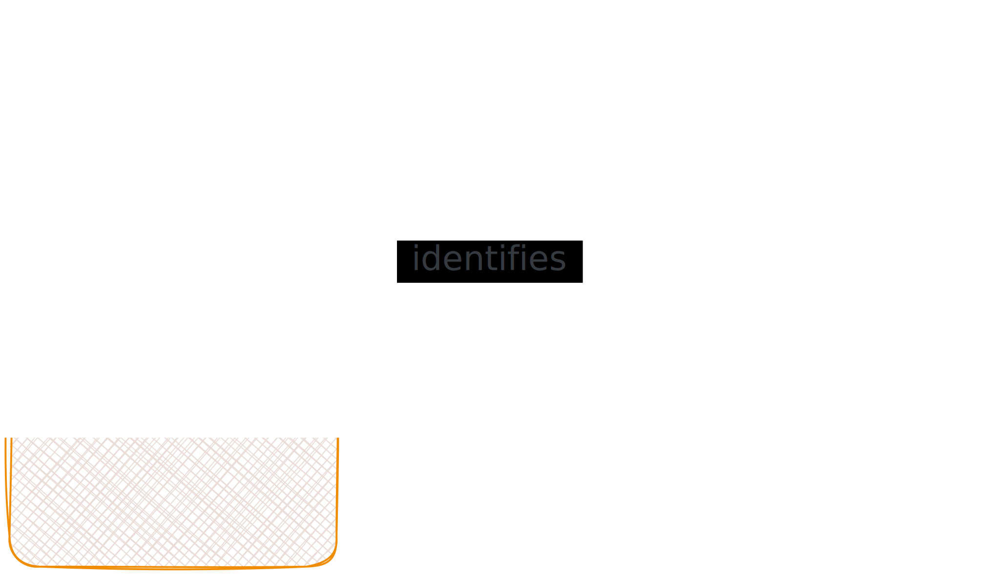

# RFC 3986: URI Generic Syntax

Link: [RFC 3986](https://www.rfc-editor.org/rfc/rfc3986) (Berners-Lee, et al. Standards Track)

A URI:

- Is a **compact sequence of characters**.
- That identifies an **abstract or physical resource**.

This spec defines:

- The **generic URI syntax**: A grammar that is a **superset** of all valid URIs, allowing parsing of common components **without knowing scheme-specific requirements**.

  > Remark: Take it like this spec specifies the raw/bare grammars of URIs, schemes like HTTP, FTP, etc. narrow it down.

- Out-of-scope - URI semantics: This is mandated by each scheme + the application.

- A process for **resolving relative URI-references**. Absolute URI-references don't need resolution since they're already complete.

- Guidelines and **security considerations** for URI use on the Internet.

The spec does not define a generative grammar for URIs. Each URI scheme (e.g. `http`, `ftp`, `urn`) defines its own specific rules.

> Can be useful for Semdown: For designing new URI schemes, see [RFC 2718](https://www.rfc-editor.org/rfc/rfc2718).



## Context (Unicode Revisited)

If my memory is not getting rusty:

- **Coded character set (CCS)**: Mapping from characters to code points (integers).
- **Character encoding scheme (CES)**: Mapping from code points to octet sequences.
- **Charset** (IANA/IETF usage): Ambiguous. This RFC avoids "charset" and uses "character encoding" instead.

## URI Overview

A URI is a character sequence matching the `<URI>` syntax rule (see [Syntax Components](#syntax-components)).

**Terminology note**: In this spec, "URI" strictly means the **absolute** form (always has a scheme). What most people casually call "a URI" is technically a **URI-reference**, which can be either:

- An **absolute URI-reference**: A full URI with a scheme. E.g. `http://example.com/foo`.
- A **relative URI-reference**: No scheme, resolved against a base URI. E.g. `../foo`, `#section`.

The RFC itself uses "relative reference" instead of "relative URI-reference" because older specs used "relative URI" and people confused it as a subset of URIs (it's not, it's a _reference to_ a URI). This document uses "relative URI-reference" for clarity.

URI = U (uniform) + R (resource) + I (identifier).

- **Uniform**: A bare-bone, base form for identifiers. Because the syntax is shared, the following holds.
  - All schemes (`http://`, `ftp://`, `mailto:`, `urn:`) parse the same way.
  - Common syntactic conventions have uniform semantic interpretation across schemes.
  - New schemes can be introduced without breaking existing ones.
  - Identifiers can be reused across contexts, so new applications/protocols can leverage the existing, widely used set.

- **Resource**: Anything that can be identified, the scope is not limited.
  - Not necessarily accessible via the internet. A URI can name something without implying you can fetch it.

- **Identifier**: Embodies the information required to distinguish one resource from all others within its scope.
  - "Identify" = distinguish the thing being identified from the other things within its scope of identification, regardless of how (by name, address, or context).
  - Identification is accomplished via an extensible set of **naming schemes** (e.g. `http`, `ftp`). How identification works is delegated to each scheme.
  - **An identifier does NOT mean "define"**: A URI doesn't necessarily embody the identity of what it references (though it may).
  - **An identifier does NOT imply access**: URIs often denote resources without any intention of fetching them.
  - The "one" resource might not be singular: Could be a named set or a mapping that varies over time.
    - A URI is **not required to persist** in identifying the same resource over time (though that's a common goal).
  - Applications can limit themselves to particular resource types or URI subsets.

### Global Interpretation, NOT Identity/Access

URIs provide global **interpretation**, not necessarily global **identity**.

- The _rules for reading a URI_ are the same everywhere. Everyone parses `http://localhost/` the same way: "HTTP server on loopback". That's global interpretation.
- But the _resource_ it points to may differ per context. `http://localhost/` resolves to a different machine for each user. So it's not a global identifier in the "same thing for everyone" sense.
- Whether the identified resource is globally unique depends on the URI you choose, not the spec.
  - Globally unique: `https://en.wikipedia.org/wiki/Graph_database` (same page for everyone).
  - Context-dependent: `file:///etc/hosts` (your local file). Use only when the local context is a defining aspect of the resource.

This is why the semantic web insists on URIs like `http://dbpedia.org/resource/London` instead of just "London": To guarantee global uniqueness, not just global parseability.

### URI, URL, and URN

A URI can be classified as a locator, a name, or both:

- **URL** (Uniform Resource Locator): A URI that also provides a means of _locating_ the resource by describing its access mechanism (e.g. network location). `http://example.com/page` is a URL.
- **URN** (Uniform Resource Name): A URI that is required to remain globally unique and persistent, even when the resource ceases to exist. `urn:isbn:0451450523` is a URN.

The distinction is blurry in practice:

- A scheme doesn't have to be just "name" or "locator". Whether a URI acts as a name or locator depends on how identifiers are assigned, not on the scheme itself.
- The spec recommends using the general term **"URI"** rather than the more restrictive "URL" or "URN".

## Design Goals & Considerations

This section lists the design goals for URIs.

### Transcription

URIs are designed for **global transcription**: Writeable on a napkin, typeable on any keyboard, parseable by any system.

- A URI is a sequence of characters from a very limited set: Basic Latin letters, digits, and a few special characters.
- A URI is NOT always a sequence of octets. It can be ink on paper, pixels on a screen, or encoded bytes.
- **Interpretation depends only on the characters, not on how they're represented in a network protocol.** This means URIs should be normalized into one canonical form.

Three design tensions:

- URIs are not always digital: They must be transcribable from non-network sources (napkins, whiteboards, speech).
- URIs should be typeable: Constrained by keyboards across languages and locales.
- URIs should be memorable: Meaningful, familiar components help.

These goals conflict. A meaningful name might need characters that can't be typed on some keyboards. The spec prioritizes **transcribability over meaningfulness**.

For characters outside US-ASCII, [**percent-encoding**](#percent-encoding) can represent them as `%HH` octets, if allowed by the scheme.

### Separating Identification from Interaction

As mentioned above: A URI only provides **identification**. Access is neither guaranteed nor implied.

- **What a URI does**: Identifies a resource.
- **What a URI does NOT do**: Define how to access it. Operations (access, update, replace, find attributes) are defined by the protocol using the URI, not by the URI spec.

General terms on interaction with URIs:

- **Resolution**: Determining the access mechanism and parameters needed to dereference a URI. May require several iterations.
- **Dereference**: Using that access mechanism to perform an action on the resource.
- **Retrieval**: The most common form of dereference. Returns a **representation** (a sequence of octets + representation metadata describing the resource's state at a point in time).

Important nuances:

- **Late-binding**: The result of accessing a URI is determined at access time and may vary. A URI identifies a _sameness of characteristics over time_, not a specific past result.
- **Scheme != protocol**: `http://` URIs are often used purely for identification, without ever making an HTTP request. Even when accessed, the actual resolution may involve DNS, proxies, caches, gateways, independently of the scheme name.

## Generic Syntax

The URI syntax is a **federated and extensible naming system**:

- Each URI begins with a **scheme name** (e.g. `http`, `ftp`, `urn`) that refers to a specification for assigning identifiers within that scheme.
- Each scheme may further restrict the syntax and semantics of its identifiers.
- This spec defines only what's **common to all schemes**: The elements required or shared across schemes.

This design enables **two-phase parsing**:

1. **Scheme-independent**: A generic parser extracts major components (scheme, authority, path, query, fragment) from any URI, without knowing the scheme.
2. **Scheme-specific**: Once the scheme is determined, further parsing can be performed on the components.

This allows for **decoupling**: Identification schemes, protocols, data formats, and implementations all evolve independently. A protocol can accept any URI, including schemes that don't exist yet.

### Characters

A URI is a sequence of characters from a limited set (US-ASCII based).

| Category            | Characters                            |
| ------------------- | ------------------------------------- |
| **Reserved**        | `: / ? # [ ] @ ! $ & ' ( ) * + , ; =` |
| **Unreserved**      | `A-Z a-z 0-9 - . _ ~`                 |
| **Percent-encoded** | `%HH` (e.g. `%20` = space)            |

#### Reserved Characters

Reserved characters can act as delimiters.

"Reserved" means the encoded and unencoded forms have different meanings: `a/b` (two path segments) is not the same as `a%2Fb` (one segment containing a literal slash).

Two levels:

- `: / ? # [ ] @` separate the five top-level components. These are the **only** characters the generic parser acts on: `:` after scheme, `//` starts authority, `/` starts path, `?` starts query, `#` starts fragment. **Everything between these delimiters is opaque to the generic parser**.
- `! $ & ' ( ) * + , ; =` separate smaller pieces _inside_ a component. The generic parser **ignores** them entirely. Only the scheme or application gives them meaning (e.g. in HTTP, `&` separates query parameters, `=` separates key from value).

Motivation:

- Schemes need to guarantee that unencoded `&` is always a delimiter and `%26` is always data.
- If these were unreserved, encoding wouldn't change the meaning, and schemes couldn't use them as delimiters.

When producing a URI, **percent-encode reserved characters** **UNLESS** the scheme specifically allows them as data in that component.

If a reserved character appears with no known delimiting role, it's treated as literal data.

For example, `@` delimits userinfo from host in the authority (`user@host`), but in a path (`/path/@file`) the scheme allows it as data, so no encoding needed.

Because percent-encoding reserved characters changes meaning, they are **protected from normalization**. Normalization (transforming a URI into canonical form for comparison, e.g. lowercasing the scheme) must never decode reserved characters.

> Remark: I found this a bit confusing.

#### Unreserved Characters

Unreserved characters carry no delimiting role.

Percent-encoding them does not change the meaning (`a` == `%61`). They **SHOULD NEVER** be percent-encoded, and should be decoded during normalization.

#### Percent-Encoding

- Represents a **data octet** as **`%` + 2 hex digits** (e.g. `%20` = space).
- Prefer **uppercase hex**.
- `%` itself as data is encoded as `%25`.

### Hierarchical Identifiers

URI syntax is organized hierarchically with the most significant component on the left.

`:` separates the scheme, then `/`, `?`, `#` delimit components in a consistent way, aiding readability and allowing scheme-independent references.

Not all schemes are hierarchical. The generic parser always runs first on every URI, but what it can extract differs:

- **Hierarchical** (e.g. `http://example.com/path?q=1#s`): The generic parser extracts **multiple** meaningful components: Scheme = `http`, authority = `example.com`, path = `/path`, query = `q=1`, fragment = `s`.
- **Opaque** (e.g. `mailto:user@example.com`): The generic parser still runs, but **only** gets scheme = `mailto` and one blob = `user@example.com`. The `@` means **nothing** to the generic parser. Only the scheme-specific parser (running second) understands the internal structure.

Schemes should use hierarchical syntax unless there's a compelling reason not to.

### Relative References

Because URIs are hierarchical, references can be made _relative to_ the current context rather than always being absolute.

- Document trees become partially independent of their location and access scheme.
- A document tree can be moved as a whole without changing any internal references.

A relative reference describes the difference between the current context and the target. Relative references **only** work within hierarchical URIs.

### Syntax Components (Absolute URI)

The **generic URI syntax** defines 5 components for an absolute URI (**scheme**, **authority**, **path**, **query** and **fragment**), **delimited by the generic delimiters the generic parser recognizes**. A relative reference omits the scheme (and possibly authority), relying on a base URI to fill them in:

```
  foo://example.com:8042/over/there?name=ferret#nose
  \_/   \______________/\_________/ \_________/ \__/
   |           |            |            |        |
scheme     authority       path        query   fragment
```

```
URI = scheme ":" hier-part [ "?" query ] [ "#" fragment ]
```

- **scheme** and **path** are **required** (path may be empty).
- **authority** is **optional**.
  - When **present**, path **must** be **empty or start with `/`**.
  - When absent, path **cannot** start with `//`.
- **query** and **fragment** are **optional**.

An opaque URI has no authority, just scheme + path:

```
  urn:example:animal:ferret:nose
  \_/ \________________________/
   |             |
scheme          path
```

#### Scheme

The first component of an URI.

Refers to a specification for assigning identifiers within that scheme.

- Starts with a letter, followed by letters, digits, `+`, `-`, `.`.
- **Case-insensitive**, but **canonical form** is **lowercase**.
- New schemes are registered via [BCP 35](https://www.rfc-editor.org/info/bcp35). All valid scheme-specific syntax must be valid according to the `<absolute-URI>` grammar as defined by the spec.
- A URI violating scheme-specific restrictions should be flagged as an **error**, **not** silently ignored.

#### Authority

An **optional URI component** that some URI schemes use.

This component specifies a **naming authority** to delegate governance of the namespace (defined by the remainder of the URI) to.

- Preceded by `//`.
- Terminated by `/`, `?`, `#`, or end of URI.

An authority can contain sub-components:

```
authority = [ userinfo "@" ] host [ ":" port ]
```

- **userinfo** is an optional subcomponent. Some schemes disallow it.
  - The `user:password` format is **deprecated**, although still used by some, like many DBMS connection URIs (cleartext credentials).
  - It should be rendered distinctly to prevent phishing (e.g. `http://trusted.com@evil.com/`).
- **host** is a mandatory subcomponent.
  - It can be an IP literal (`[2001:db8::7]`), IPv4 (`192.0.2.1`), or registered name (`example.com`).
  - It is **case-insensitive**.
  - Having a host does **NOT** imply Internet access.
- **port** is an optional subcomponent. Some schemes disallow it.
  - Schemes may define **defaults** (e.g. `http` = 80).
  - It should be omitted if empty or equal to the default.
- The generic parser recognizes `//` but treats **authority internals as opaque** until scheme-specific parsing.

Summary: The generic parser always parses the authority components. The scheme spec declares which are required, optional, or forbidden, and rejects violations. Example: `mailto:user@host` has no `//`, so the generic parser puts `user@host` in the path, not authority.

#### Path

A required component but may be empty.

- Composed of many segments.
- Segments separated by `/`.
- Terminated by `?`, `#`, or end of URI.

Rules:

- With authority: **Must** be empty or start with `/`.
- Without authority: **Cannot** start with `//`.
- Relative reference: First segment **cannot** contain `:`. A URI-reference (`URI / relative-ref`) could be either a full URI or a relative reference. Since `letters:` always parses as a scheme, a relative path like `this:that` would be misinterpreted as scheme `this` + path `that`. Use `./this:that` to disambiguate.

Segments are **opaque** to the generic parser (**EXCEPT** `.` and `..` dot-segments for relative resolution).

Schemes may use **sub-delimiters** within segments (e.g. `name;v=1.1`).

### Query

- Used to represent **non-hierarchical** data that are used to identify the target along with the path components.
- Indicated by `?`, terminated by `#` or end of URI.
- `/` and `?` are allowed as data, but discouraged due to some erroneous implementation. The generic parser treats the entire query as **one opaque string**.
- Internal structure (e.g. `key=value` pairs separated by `&`) is defined by the scheme or application using sub-delimters, **not** by the generic syntax.

### Fragment

- Indicated by `#`, terminated by end of URI.
- Identifies a **secondary** resource relative to a primary resource.

The fragment is separated **before** dereference, so the server **never** sees it.

**Semantics are defined by the **media type**, not the scheme.**

## Usage & Abbreviated Forms

Applications don't always use the full absolute URI form. The spec formally defines several shorter forms (relative references, same-document references, etc.) that are **valid** and well-specified, not broken or invalid. They depend on the generic syntax and require a defined resolution process.

### URI Reference

The most common usage form. A URI-reference is either a full URI or a relative reference.

- If the prefix matches `scheme:`, it's a full URI.
- Otherwise, it's a **relative reference**.

Parsing: A URI-reference is first split into the five components to determine what's present and whether it's relative. Then each component is parsed for subparts.

### Relative Reference

Expresses a URI reference relative to another hierarchical URI's namespace.

- **Network-path reference**: Starts with `//`. Rarely used.
- **Absolute-path reference**: Starts with a single `/`.
  > Remark: It's interesting that **relative reference** has an **absolute-path reference** style.
- **Relative-path reference**: Does **not** start with `/`.
- A first segment containing `:` (e.g. `this:that`) would be mistaken for a scheme. Prefix with `./` to disambiguate: `./this:that`.

The target URI is obtained by applying the [**reference resolution algorithm**](#resolution-algorithm).

### Absolute URI

Some protocol elements require a full URI **without** a fragment. For example, a base URI definition cannot have a fragment.

```
absolute-URI = scheme ":" hier-part [ "?" query ]
```

Scheme specs **must** ensure their syntax matches this grammar. Fragment syntax is **not** defined by scheme specs since it's orthogonal to scheme definition.

### Same-Document Reference

A URI reference that, ignoring the fragment, is identical to the base URI. Most common form: `#fragment` or an empty reference.

- Dereferencing a same-document reference should **not** trigger a new retrieval. The target is within the same entity as the reference.

### Suffix Reference

Informal abbreviations used in traditional media (TV, billboards, newspapers): Just the authority and path, like `www.w3.org/Addressing/` or a bare domain name.

- Intended for **human** interpretation, relying on context-based heuristics (e.g. `www` prefix implies `http://`).
- Should be **avoided** for long-term or machine-readable references. Heuristics change over time and can create security issues.
- Has the same syntax as a relative-path reference, so it **cannot** be used where relative references are expected.

## Reference Resolution

Resolving a URI reference within a context that allows relative references, producing an absolute URI.

See [section 5](https://www.rfc-editor.org/rfc/rfc3986#section-5).
