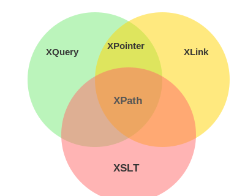

# XSLT: Template Engine for XML



XSLT (**eXtensible Stylesheet Language Transformations**) **transforms** XML documents into other formats (HTML, other XML, plain text, etc.).

> Analogy: XSLT is to XML what **template engines** (Jinja, Handlebars, JSX) are to HTML in web frameworks.

> Remark: XSLT and [XQuery](./xquery.md) overlap significantly, but XSLT is **template-driven** (declare patterns, the processor applies them) while XQuery is **expression-driven** (explicitly select and construct). XSLT is better suited for document transformation, while XQuery is better suited for data querying.

> Remark: XML starts to look like Semdown's idea. XSLT in Semdown would be for static site generation.

Part of the [XSL family](./core.md#xsl-family).

## Basics

An XSLT stylesheet **is itself an XML document**. No new syntax, just new elements in the `xsl:` namespace.

Two types of content in a stylesheet:

- **XSLT elements** (`xsl:` prefix): Instructions the processor **executes**.
- **Literal result elements** (everything else): Copied **directly** to the output.

The processor distinguishes them by namespace: `xsl:` = instruction, anything else = output.

### Declaring a Stylesheet

```xml
<?xml version="1.0" encoding="UTF-8"?>
<xsl:stylesheet version="1.0"
  xmlns:xsl="http://www.w3.org/1999/XSL/Transform">
  <!-- templates go here -->
</xsl:stylesheet>
```

`<xsl:stylesheet>` and `<xsl:transform>` are synonymous.

### Linking to XML

```xml
<?xml-stylesheet type="text/xsl" href="catalog.xsl"?>
```

One XML file can be transformed by **many different stylesheets**.

## How It Works

A **template** is a rule: "When you encounter _this pattern_, produce _this output_".

1. The XSLT processor walks the XML tree.
2. At each node, it checks if any template's `match` attribute matches.
3. If so, it executes that template.

If **multiple templates** match, the most specific wins (e.g. `match="catalog/cd/title"` beats `match="title"`). If no template matches, built-in defaults pass through to children or output text.

`<xsl:apply-templates>` is like a recursive function call: "Process these children, find the right template for each". This is how templates chain together.

## XSL Elements

Three types of attributes:

- **`match`** (XPath pattern): Declares _which nodes_ trigger this template. The processor decides when to use it.
- **`select`** (XPath): Actively selects _which nodes_ to operate on.
- **`test`** (boolean XPath): Evaluates to true/false for conditionals.

| Element                 | Attribute           | Purpose of XPath                  | Purpose                      |
| ----------------------- | ------------------- | --------------------------------- | ---------------------------- |
| `<xsl:template>`        | `match`             | Which nodes trigger this template | Produce output when matched  |
| `<xsl:value-of>`        | `select`            | Navigate to a node, extract text  | Output a value               |
| `<xsl:for-each>`        | `select`            | Select node set to iterate        | Loop over matches            |
| `<xsl:sort>`            | `select`            | Pick sort key                     | Sort the enclosing loop      |
| `<xsl:if>`              | `test`              | Evaluate condition                | Render only when true        |
| `<xsl:when>`            | `test`              | Evaluate condition                | Branch inside `<xsl:choose>` |
| `<xsl:otherwise>`       | (none)              | (none)                            | Default branch               |
| `<xsl:apply-templates>` | `select` (optional) | Which children to delegate        | Find right template for each |

## Examples

All examples use this XML:

```xml
<catalog>
  <cd><title>Empire Burlesque</title><artist>Bob Dylan</artist><price>10.90</price></cd>
  <cd><title>Hide your heart</title><artist>Bonnie Tyler</artist><price>9.90</price></cd>
  <cd><title>Greatest Hits</title><artist>Dolly Parton</artist><price>9.90</price></cd>
</catalog>
```

### `template` XML Element

Declares a rule: When a node matches the `match` pattern, produce this output.

```xml
<xsl:template match="/">
  <h1>Catalog</h1>
</xsl:template>
```

Output: `<h1>Catalog</h1>`

### `value-of` XML Element

Outputs the text value of the selected node. Without a loop, selects the **first** match only.

```xml
<xsl:template match="/">
  <p><xsl:value-of select="catalog/cd/title"/></p>
</xsl:template>
```

Output: `<p>Empire Burlesque</p>`

### `for-each` XML Element

Loops over all nodes matching the `select` expression. Can filter with predicates: `select="catalog/cd[artist='Bob Dylan']"`.

```xml
<xsl:for-each select="catalog/cd">
  <p><xsl:value-of select="title"/></p>
</xsl:for-each>
```

Output: `<p>Empire Burlesque</p><p>Hide your heart</p><p>Greatest Hits</p>`

### `sort` XML Element

Sorts the enclosing `for-each` loop by the value selected in `select`. Place as the first child of `for-each`.

```xml
<xsl:for-each select="catalog/cd">
  <xsl:sort select="artist"/>
  <p><xsl:value-of select="artist"/></p>
</xsl:for-each>
```

Output: `<p>Bob Dylan</p><p>Bonnie Tyler</p><p>Dolly Parton</p>`

### `if` XML Element

Conditional output. Only renders content when the `test` expression evaluates to true.

```xml
<xsl:for-each select="catalog/cd">
  <xsl:if test="price &gt; 10">
    <p><xsl:value-of select="title"/></p>
  </xsl:if>
</xsl:for-each>
```

Output: `<p>Empire Burlesque</p>`

### `choose`/`when`/`otherwise` XML Elements

Switch/case branching. `when` branches are tested in order, `otherwise` is the default fallback.

```xml
<xsl:for-each select="catalog/cd">
  <xsl:choose>
    <xsl:when test="price &gt; 10">
      <p style="color:red"><xsl:value-of select="title"/></p>
    </xsl:when>
    <xsl:otherwise>
      <p><xsl:value-of select="title"/></p>
    </xsl:otherwise>
  </xsl:choose>
</xsl:for-each>
```

Output: Empire Burlesque in red, others in default.

### `apply-templates` XML Element

Delegates processing to other templates. The processor finds the right template for each matched child. The modular alternative to `for-each`: Each node type has its own template.

```xml
<xsl:template match="/">
  <xsl:apply-templates select="catalog/cd"/>
</xsl:template>

<xsl:template match="cd">
  <p><xsl:apply-templates select="title"/> by <xsl:apply-templates select="artist"/></p>
</xsl:template>

<xsl:template match="title"><b><xsl:value-of select="."/></b></xsl:template>
<xsl:template match="artist"><i><xsl:value-of select="."/></i></xsl:template>
```

Output: `<p><b>Empire Burlesque</b> by <i>Bob Dylan</i></p>` (for each CD)
