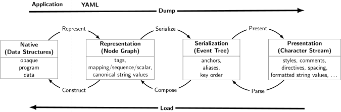
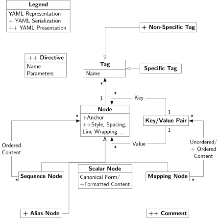
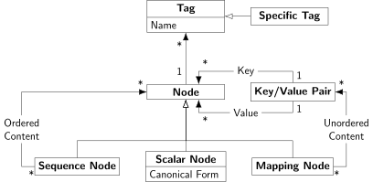
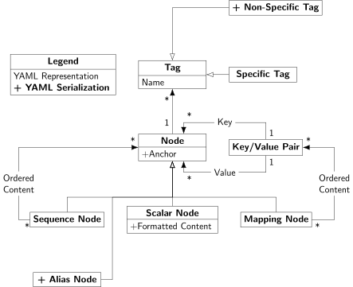
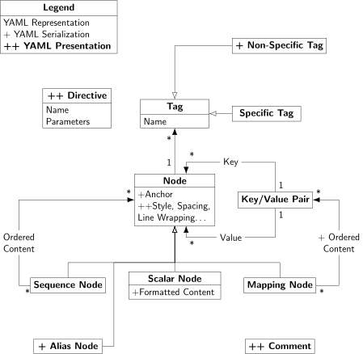
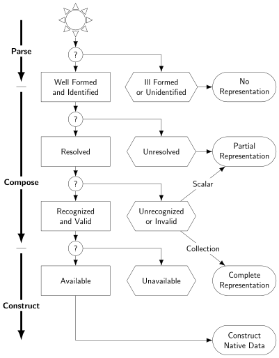

# YAML 1.2

Link: https://yaml.org/spec/1.2.2/

## Overview

YAML 1.2 has evolved to:

- Be a strict superset of JSON.
- Remove many obscure rules like implicit typings.

The general important [goals](https://yaml.org/spec/1.2.2/#goals) of YAML:

1. Be human-readable.
2. Be portable across languages.
3. Easy to parse/implement/use.

Context: PyYAML is generally considered the reference implementation. LibYAML is generally used in other YAML frameworks.

## Structure

To understand YAML, one should:

- Understand its information model, that is, the abstract model of how YAML decides to organize data. (See [Processes and Models](#processes-and-models))
- Translation of that information model to the YAML textual format.

## Features Overview

This section lists all features of YAML, to motivate the YAML specification later.

Three basic building blocks: Scalars, Sequences, Mappings. (for more details check [Scalars](#scalars) onwards)

### Syntax

#### Block Syntax

- Indentation is used for scope: Same indentation = Same list/hash.
- A line is used for specifying an entry within the list/hash.

Entry syntax:

- **Block sequences** use a dash and a space (`- `) for each entry.
- **Block mappings** use a colon and a space (`: `) for each key/value pair.

Comments use `#`.

Example:

```yaml
house_1:
  - person_1 # First entry of the first key/value pair
  - hrnax # Second entry of the first key/value pair
```

Example from the spec:

```yaml
- name: Mark McGwire
  hr: 65
  avg: 0.278
- name: Sammy Sosa
  hr: 63
  avg: 0.288
```

For a more compact representation, see [Compact Nested Mapping](#compact-nested-mapping).

#### Flow Syntax

- Indicators are used to denote scopes.
- Puntuations are used to denote entries.

Entry syntax:

- **Flow sequences** use a comma-separated list within square brackets.
- **Flow mappings** use a comma-separated list of key/value pairs within curly braces.

```yaml
flow mapping: { a: 1, b: 2 }

flow sequence:
  - [1, 2, 3]
  - [4, 5, 6]
```

#### Data Sharing

In data structures, it's common to have an object/list to be shared in more than one places.

YAML allows this by **anchors** (`&`) and **aliases** (`*`), kind of like C++ address-of and dereferencing operators.

Example from the spec:

```yaml
hr:
  - Mark McGwire
  # Following node labeled SS
  - &SS Sammy Sosa
rbi:
  - *SS # Subsequent occurrence
  - Ken Griffey
```

#### Complex Mapping Keys

Sometimes mapping keys need to be more than simple scalars, e.g using a list as a key.

A question mark and space (`? `) indicates a complex mapping key. Within a block collection, key/value pairs can start immediately following the dash, colon or question mark.

Example from the spec:

```yaml
? - Detroit Tigers
  - Chicago cubs
: - 2001-07-23

[New York Yankees, Atlanta Braves]: [2001-07-02, 2001-08-12, 2001-08-14]
```

#### Compact Nested Mapping

It's common to have a list of objects (e.g. a product catalog).

Within a block sequence, key/value pairs can start immediately after the dash, allowing compact representation of lists of mappings.

Example from the spec:

```yaml
# Products purchased
- item: Super Hoop
  quantity: 1
- item: Basketball
  quantity: 4
- item: Big Shoes
  quantity: 1
```

### Structures

YAML files can be made up of **directives** and **document content**.

- **Directives**: instructions for the YAML processor, not part of the data. YAML 1.2 defines 2 directives: `%YAML` (version) and `%TAG` (tag shorthands).
- **Document content**: the actual data described in the above section, such as scalars, sequences, and mappings.

Syntactically:

- `---` is used to separate directives from content, and signals start of a new document (even without directives, effectively just document separators).

  Example from the spec:

  ```yaml
  # Ranking of 1998 home runs
  ---
  - Mark McGwire
  - Sammy Sosa
  - Ken Griffey

  # Team ranking
  ---
  - Chicago Cubs
  - St Louis Cardinals
  ```

- `...` is used to signal the end of a document without starting a new one.

  Example from the spec:

  ```yaml
  ---
  time: 20:03:20
  player: Sammy Sosa
  action: strike (miss)
  ...
  ---
  time: 20:03:47
  player: Sammy Sosa
  action: grand slam
  ...
  ```

### Scalars

Scalars are YAML's atomic values: strings, numbers, booleans, etc. Unlike sequences and mappings, they hold a single value.

Scalar content can be written in two notations: **block** and **flow**.

#### Block Scalars

Block scalars are useful for multi-line strings where whitespace and newline control matters (e.g. embedded config, prose, ASCII art).

In block scalars, the base indentation is determined by the first non-empty content line. That indentation is stripped from all lines.

Block scalars have two styles:

- **Literal style** (`|`): all line breaks are preserved as-is.
- **Folded style** (`>`): newlines are folded to spaces, **except** lines that are blank or more-indented than the base, those preserve their newlines.

Examples:

- In literal style (`|`), newlines are preserved.

  Example:

  ```yaml
  newlines_preserved: |
    First line
    Second line
    Third line
  ```

  Interpreted: `"First line\nSecond line\nThird line\n"`

- In folded style (`>`), newlines become spaces. Newlines are preserved for more-indented and blank lines.

  Example from the spec:

  ```yaml
  description: >
    Mark McGwire's
    year was crippled
    by a knee injury.
  ```

  Interpreted: `"Mark McGwire's year was crippled by a knee injury.\n"`

  Example from the spec (preserved newlines for more-indented and blank lines):

  ```yaml
  summary: >
    Sammy Sosa completed another
    fine season with great stats.

      63 Home Runs
      0.288 Batting Average

    What a year!
  ```

  Interpreted: `"Sammy Sosa completed another fine season with great stats.\n\n  63 Home Runs\n  0.288 Batting Average\n\nWhat a year!\n"`

- A document's root node can itself be a scalar, the block scalar indicator follows `---` directly ([§9.1.3. Bare Documents](https://yaml.org/spec/1.2.2/#913-bare-documents)):

  ```yaml
  --- |
    entire document
    is one literal scalar
  ```

- Indentation determines scope ([§6.1. Indentation Spaces](https://yaml.org/spec/1.2.2/#61-indentation-spaces)): a block scalar ends when indentation drops back to the parent's level. Lines below the base indentation but above the parent's level are invalid ([§8.1.1. Block Scalar Headers](https://yaml.org/spec/1.2.2/#811-block-scalar-headers)):

  Example from the spec:

  ```yaml
  name: Mark McGwire
  accomplishment: >
    Mark set a major league
    home run record in 1998.
  stats: |
    65 Home Runs
    0.278 Batting Average
  ```

#### Flow Scalars

Flow scalars are inline, useful for short strings, values with special characters, or when you want to stay on one line.

YAML's flow scalars have 3 styles:

- The **plain style**
- Two **quoted styles**:
  - The double-quoted style provides escape sequences.
  - The single-quoted style is useful when escaping is not needed.

All flow scalars can span multiple lines. Line breaks are always folded.

- Quoted scalars:

  Example from the spec:

  ```yaml
  unicode: "Sosa did fine.\u263A"
  control: "\b1998\t1999\t2000\n"
  hex esc: "\x0d\x0a is \r\n"

  single: '"Howdy!" he cried.'
  quoted: " # Not a 'comment'."
  tie-fighter: '|\-*-/|'
  ```

- Multi-line flow scalars:

  Example from the spec:

  ```yaml
  plain: This unquoted scalar
    spans many lines.

  quoted: "So does this
    quoted scalar.\n"
  ```

### Tags

Every YAML node has a **tag** that denotes its type (e.g `!!str`, `!!int`, `!!seq`).

For simplicity though, most nodes don't specify one explicitly: they are **untagged** and the YAML processor resolves a tag automatically based on the active **schema**, which defines the set of available tags and how untagged nodes are resolved (e.g `123` -> `!!int`, `true` -> `!!bool`).

YAML 1.2 defines three built-in schemas:

- **Fail safe schema**: the minimum every processor must support. Only `!!str`, `!!seq`, `!!map`.
- **JSON schema** (recommended): adds `!!null`, `!!bool`, `!!int`, `!!float`.
- **Core schema** (recommended): extends JSON schema with human-friendly notations (e.g octal `0o14`, hex `0xC`, `~` for null).

The examples in this specification generally use the `seq`, `map` and `str` types from the fail safe schema. A few examples also use the `int`, `float` and `null` types from the JSON schema.

- Integers:

  Example from the spec:

  ```yaml
  canonical: 12345
  decimal: +12345
  octal: 0o14
  hexadecimal: 0xC
  ```

- Floating point:

  Example from the spec:

  ```yaml
  canonical: 1.23015e+3
  exponential: 12.3015e+02
  fixed: 1230.15
  negative infinity: -.inf
  not a number: .nan
  ```

- Miscellaneous:

  Example from the spec:

  ```yaml
  null:
  booleans: [true, false]
  string: "012345"
  ```

- Timestamps:

  Example from the spec:

  ```yaml
  canonical: 2001-12-15T02:59:43.1Z
  iso8601: 2001-12-14t21:59:43.10-05:00
  spaced: 2001-12-14 21:59:43.10 -5
  date: 2002-12-14
  ```

#### Explicit Tags

Explicit typing is denoted with a tag using the exclamation point (`!`) symbol.

There are two kinds of tags:

- **Local tags**:
  - Motivation: Sometimes tags are only required to have meanings within the consuming application.
    - Start with `!` and are application-specific (e.g `!circle`).
    - Don't need to be declared, you just use them inline.
- **Global tags**:
  - Motivation: When interoperability matters, tags that are universally recognized across different processors are useful. 
  - Syntax: full URIs that are universally unique (e.g `tag:yaml.org,2002:str`), standardized across all processors.

Since global tags are verbose, YAML provides **tag handles** (also called tag shorthands): short prefixes that expand to a URI prefix, declared via the `%TAG` directive.

Two handles are built-in:

- `!!` defaults to `tag:yaml.org,2002:`, so `!!str` expands to `tag:yaml.org,2002:str`.
- `!` is the primary handle for local tags.

Custom handles can also be defined:

```yaml
%TAG !e! tag:example.com,2002:
---
- !e!circle   # expands to tag:example.com,2002:circle
  radius: 7
```

- Example from the spec:

  ```yaml
  %TAG ! tag:clarkevans.com,2002:
  ---
  !shape
  # Use the ! handle for presenting
  # tag:clarkevans.com,2002:circle
  - !circle
    center: &ORIGIN { x: 73, y: 129 }
    radius: 7
  - !line
    start: *ORIGIN
    finish: { x: 89, y: 102 }
  - !label
    start: *ORIGIN
    color: 0xFFEEBB
    text: Pretty vector drawing.
  ```

- Unordered sets:

  Example from the spec:

  ```yaml
  # Sets are represented as a
  # Mapping where each key is
  # associated with a null value
  --- !!set
  ? Mark McGwire
  ? Sammy Sosa
  ? Ken Griffey
  ```

- Ordered mappings:

  Example from the spec:

  ```yaml
  # Ordered maps are represented as
  # A sequence of mappings, with
  # each mapping having one key
  --- !!omap
  - Mark McGwire: 65
  - Sammy Sosa: 63
  - Ken Griffey: 58
  ```

## Processes and Models

YAML serves two consumers: machines that process data, and humans that read it. To bridge these perspectives, YAML defines two complementary concepts:

- **YAML representations**: an abstract data model (graph of typed nodes) that captures *what* the data is, independent of any textual format.
- **YAML stream**: a concrete character stream for presenting those representations in a human-readable way.

A **YAML processor** (e.g PyYAML, libyaml) converts between these two views. It works on behalf of an **application** (e.g a config loader, a deployment tool): the processor handles YAML mechanics, the application decides what the data means.

### Three stages

The conversion between representations and streams is broken into three stages:

1. **Representation**: native data structures -> a directed graph of typed nodes.
2. **Serialization**: the graph -> an ordered event tree (linearized for sequential output).
3. **Presentation**: the event tree -> a human-readable character stream.

Note: "serialization" in YAML does not mean producing text. It means linearizing the graph into an ordered form. The actual text output is the presentation stage.

> The event-based approach (decoupling structure from output via an event stream) is a common pattern in parser design. rust-analyzer uses a similar technique, where the parser emits events (start-node, token, end-node) to build a lossless syntax tree. The difference: YAML events discard presentation details, while rust-analyzer events preserve everything (whitespace, comments, errors).



### Processes

A processor need not expose all three stages. It may translate directly between native data structures and a character stream (dump and load). However, even when skipping stages, it should behave *as if* it went through all three. Native data structures should only depend on information in the representation (node kinds, tags, content), not on presentation or serialization details like key order, comments, or tag handles.

In practice, this means applications that rely on YAML comments or key ordering are operating outside the spec's guarantees.

#### Dump

Dumping converts native data structures into a character stream:
native data -> graph -> events -> text.

1. **Representation: Native data -> Abstract graph**

   Native data structures are mapped to YAML's abstract model: a directed graph of typed nodes.

   Three node kinds:
   - **Sequence**: an ordered series of entries (like arrays/lists).
   - **Mapping**: an unordered set of (key, value) pairs (like hash tables/dicts). Keys and values are themselves nodes.
   - **Scalar**: a leaf node (strings, integers, dates, etc).

   The result is a directed graph, not a tree, because nodes can be shared (via anchors/aliases, where multiple parents reference the same node). Each node also carries a **tag** specifying its data type. This simple model can represent any data structure independent of programming language.

2. **Serialization: Abstract graph -> Event/Serialization tree**

   A character stream is sequential: one character after another. A graph with shared nodes and unordered keys cannot be written to a stream directly, so it must be linearized first.

   The serialization process resolves this by:
   - Imposing an ordering on mapping keys.
   - Replacing shared node references with placeholders called aliases.

   The result is an event tree: an ordered sequence of events (e.g start-mapping, scalar, end-sequence). YAML does not specify how key order or anchor names are chosen.

   These are called **serialization details**.

   The YAML processor should choose a sensible human-friendly key order and anchor names.

   The serialization tree is suitable for one-pass processing of YAML data.

3. **Presentation: Event tree -> Text**

   The final stage formats the event tree as a human-readable character stream. This is where all stylistic choices are made: block vs flow, indentation, quoting, tag handles, directives, comments, etc. These are called **presentation details**.

   These details are all up to the preferences of the user & may require guidance.

#### Load

Loading is the inverse: text -> events -> graph -> native data. Each stage strips away the details added by its dump counterpart.

1. **Parsing: Text -> Event Tree**

   Takes a character stream, produces an event tree.

   Discards presentation details (styles, indentation, comments).

   Can fail on ill-formed input.

2. **Composing: Event Tree -> Graph**

   Reconstructs the representation graph from the event tree.

   Resolves aliases back into shared node references, discards serialization details (key order, anchor names). 

   Can fail on unresolved aliases.

3. **Constructing: Graph -> Native data structure**

   Converts the representation graph into native data structures (dicts, lists, strings, etc). 

   Must only rely on information in the representation (node kinds, tags, content), not presentation or serialization details.

   Can fail if required native types are unavailable.

### Information Models

The [above section](#processes) specifies the phases/procedures. This section specifies the interfaces/the data structures agreed upon by the phases.

As an analogy, in compiler construction, we have lexing, parsing, etc as the processes, while tokens, ASTs are the information models.



The diagram shows three models, each inheriting from the previous and adding new properties:

- **Representation Graph**:
  - Tag (the data type):
    - Must have a name.
    - Only specific/explicit tags are allowed here.
  - Node: A graph node.
    - Sequence node: The node representing a sequence.
      - Contains ordered sequence of nodes.
    - Mapping node: The node representing a mapping.
      - Contains unordered key/value pairs.
      - Keys and values are both nodes.
    - Scalar node: The node representing a scalar.
      - Canonical form: The interpreted value of the scalar.
- **Serialization Tree** (`+`): Inherit everything from Representation Graph and...
  - Tag:
    - (+) Add non-specific tag: Implicit tags.
  - (+) Alias node: To support serialization, alias nodes are introduced.
  - Node:
    - (+) Anchor: For aliasing.
    - Scalar node:
      - (+) Formatted content.
- **Presentation Stream** (`++`):
  - (++) Directive: Instruction to the YAML processor.
    - (++) Name.
    - (++) Parameter.
  - (++) Comment.
  - Node:
    - (++) Style, spacing, etc.

Each layer's additions (`+`, `++`) are details that should not leak into other layers. Applications should not treat key order, comments, or indentation as meaningful data. Keeping these layers separate ensures YAML representations stay consistent and portable across programming environments.

#### Representation Graph

YAML represents native data as a:
- **Rooted**: one starting node from which all others are reachable.
- **Connected**: every node is reachable from the root.
- **Directed**: edges have direction (parent points to child).

**graph** of tagged nodes.

Other properties:
- Cycles are allowed.
- Nodes can have multiple incoming edges (shared via aliases).

Two categories: **collections** (nodes defined in terms of other nodes) and **scalars** (independent nodes).



##### Nodes

Each node has content of one of three kinds, plus a tag:

- **Scalar**: an opaque datum presentable as zero or more Unicode characters.
- **Sequence**: an ordered series of zero or more nodes. May contain the same node more than once, or even itself.
- **Mapping**: an unordered set of key/value node pairs. Keys must be unique.

##### Tags

Tags represent type information & meta information about a node:
- **Global tags** are URIs, globally unique. The `tag:` URI scheme is recommended.
- **Local tags** start with `!`, application-specific.

YAML provides a `TAG` directive to make tag notation less verbose.

Notes:
- Tags that share the same URI prefix are not related in any special way.
- By **convention**, `/` is used for namespace hierarchies and `#` for variants, but each tag may use its own rules (e.g Perl uses `::`, Java uses `.`).

Each tag must specify:
- The expected node kind (scalar, sequence, or mapping).
- For scalar tags: a mechanism for converting formatted content to a canonical form (for equality testing).
- Optionally:
  - Allowed content values for validation.
  - Tag resolution rules.
  - Other metadata applicable to all of the tag's nodes.

##### Node Comparison

Mapping keys must be unique, so YAML needs a way to test node equality:

- **Canonical form**: every scalar tag must specify how to produce a canonical form from formatted content. For example, `0o13` (octal) and `0xB` (hex) both have canonical form `11`.
- **Equality**: two nodes are equal when they have the same tag and content. Scalars compare canonical forms character-by-character. Collections compare recursively.
- **Uniqueness**: a mapping's keys are unique if no two keys are equal.

Notes:
- Tag equality can use simple character-by-character comparison (since processors can't know every URI scheme's equality rules). Tags must therefore be presented in canonical form. The `tag:` URI scheme also uses this comparison method.
- If a node has itself as a descendant (via an alias, i.e circular reference), equality checking could loop forever. The spec leaves this to each processor to decide.
- A processor may treat equal scalars as identical.

#### Serialization Tree

The representation graph can't be consumed sequentially as-is: keys are unordered and nodes can be shared. The serialization tree resolves this, giving each node an ordered set of children.

When constructing native data structures from the serialization tree, key order and anchor names should not be used to preserve application data.



##### Mapping Key Order

- Mapping keys have no order in the representation. Serialization imposes one, but this is a **serialization detail**, not application data.
- Where order matters, use a sequence instead (e.g an ordered mapping = a sequence of single-pair mappings).

##### Anchors and Aliases

- A node can appear in multiple collections (shared node). To serialize this, the first occurrence gets an **anchor** (`&name`), and subsequent occurrences become **alias nodes** (`*name`) referring back to it.
- Anchor names are serialization details, discarded after composing back to a graph.
- An alias refers to the *most recent* event with that anchor name. So anchors don't need to be unique within a serialization: if two nodes use `&a`, then `*a` refers to whichever `&a` came last.
- An anchor need not have any alias referring to it (anchoring without aliasing is valid).

#### Presentation Stream

The presentation stream is the final human-readable output: a stream of Unicode characters using styles, scalar formats, comments, directives, etc. A single stream can contain multiple documents separated by markers.



##### Node Styles

- Each node is presented in some style depending on its kind. Styles are **presentation details**, not reflected in the serialization tree or representation graph.
- Two groups:
  - **Block styles**: use indentation to denote structure.
  - **Flow styles**: use explicit indicators.
- Scalar styles: literal (`|`), folded (`>`), plain, single-quoted, double-quoted.


##### Scalar Formats

- Scalars can be presented in several formats (e.g integer `11` might also be written as `0xB`). Tags must specify how to convert formatted content to canonical form.
- Like node style, format is a **presentation detail**.

##### Comments

- Comments are a **presentation detail**, they must not affect the serialization tree or representation graph.
- Not associated with any particular node. Must not appear inside scalars, but may be interleaved with scalars inside collections.

##### Directives

- Each document may have directives (a name and optional parameters). Like all presentation details, not reflected in the serialization tree or representation graph.
- YAML 1.2 defines two: `YAML` and `TAG`.

### Loading Failure Points

Loading native data structures from a YAML stream can fail at multiple points.



Two levels of representation:
- **Partial representation**: tags may be unresolved, canonical forms may be missing. Useful when type information is incomplete.
- **Complete representation**: every node has a resolved tag and canonical form. Required for constructing native data structures.

#### Well-Formed Streams and Identified Aliases

- Character stream must match the BNF productions defined in the spec. Every alias must refer to a previous node identified by an anchor.
- Processors should reject malformed streams and unidentified aliases.

```yaml
# Malformed stream: bad indentation
key: value
  bad: indent   # error: mapping values are not allowed here

# Unidentified alias: *unknown was never anchored
name: *unknown  # error: no anchor named "unknown"
```

#### Resolved Tags

- Most tags are not explicit in the character stream.
- During parsing, untagged nodes get a non-specific tag:
  - `!` for non-plain scalars (quoted or block: `'...'`, `"..."`, `|`, `>`). These are always strings.
  - `?` for everything else (plain scalars like `8080`, `true`, `hello`, and all collections). These need further resolution.
- Composing a complete representation requires resolving each non-specific tag to a specific one (global or local).
- Tag resolution depends only on:
  - The node's non-specific tag (`?` or `!`).
  - The path from root to that node (the chain of parents, i.e. structural position in the tree).
  - The node's content and kind (scalar, sequence, or mapping).
- Otherwise, tag resolution must not consider:
  - Presentation details (comments, indentation, styles).
  - Sibling node content.
  - Associated value/key content.

- These restrictions ensure tag resolution can happen as soon as a node is first encountered, typically before its content is fully parsed.
  -> This makes one-pass resolution both possible and practical.

Resolution conventions:
- `!` non-specific tag should resolve to `!!seq`, `!!map`, or `!!str` depending on node kind (scalar, sequence, or mapping). This lets authors "disable" tag resolution by explicitly writing `!`, forcing a vanilla type.
- `?` non-specific tag is where application-specific rules apply:
  - Most commonly for plain scalars: matching content against regexes for integers, floats, timestamps, etc.
  - Applications may also match mapping keys to resolve structured types (e.g. points, complex numbers).
- Processors should provide mechanisms for applications to override and expand these default rules.
- Unresolved tags are not an error. If a document contains unresolved tags, the processor can still compose a partial representation: the graph structure is built (kinds, content, relationships are all known), but some nodes keep their non-specific tag (`?` or `!`) instead of a specific one like `!!int` or `!!str`. A complete representation requires every node to have a specific tag, so native data structures can't be constructed from a partial one.

```yaml
# Resolution by content (non-specific tag ?):
port: 8080       # ? + content "8080" -> !!int
host: localhost   # ? + content "localhost" -> !!str
debug: true      # ? + content "true" -> !!bool

# Resolution by non-specific tag (! always -> vanilla type):
name: 'Alice'    # ! -> !!str (quoted, regardless of content)
count: '8080'    # ! -> !!str (even though content looks like integer)
```

Path from root can also influence resolution. An application might use the parent chain to override default rules:

```yaml
--- !server
port: 8080       # app knows path is !server -> port, so resolves to !!int
                 # even without checking content pattern
host: localhost

# But resolution must NOT look at siblings or associated nodes.
# e.g. resolving "port" cannot depend on what "host" contains.
```

#### Recognized and Valid Tags

- For a node to be fully processable, two conditions must hold:
  - The tag is **recognized**: the processor knows what the tag means (has rules for it).
  - The content is **valid**: the content matches what the tag expects (e.g. `!!int` expects integer-like content).
- Unrecognized or invalid scalars only allow partial representation.
- Unrecognized or invalid collections still allow complete representation (collection equality doesn't depend on data type knowledge), but native data structures cannot be constructed.

```yaml
# Unrecognized tag: processor doesn't know what !matrix means
transform: !matrix [[1,0],[0,1]]

# Invalid content: tag is recognized but content doesn't match
count: !!int "not a number"
```

#### Available Tags

- The processing environment may lack native types for certain tags. When unavailable, native construction fails, but a complete representation (the graph of typed nodes) can still be composed. The application can work with it as a generic structure of `(tag, content)` pairs without native conversion.

```yaml
# !!timestamp is a valid YAML tag, but not every language
# has a native timestamp type.
created: !!timestamp 2002-12-14
```

```python
# Native construction (fails if no timestamp type):
{"created": datetime(2002, 12, 14)}

# Using complete representation directly (always works):
{"created": Node(tag="tag:yaml.org,2002:timestamp", content="2002-12-14")}
# The app knows it's a timestamp (from the tag) and has
# the raw content. It can format, pass along, or convert manually.
```
